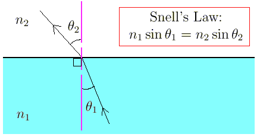
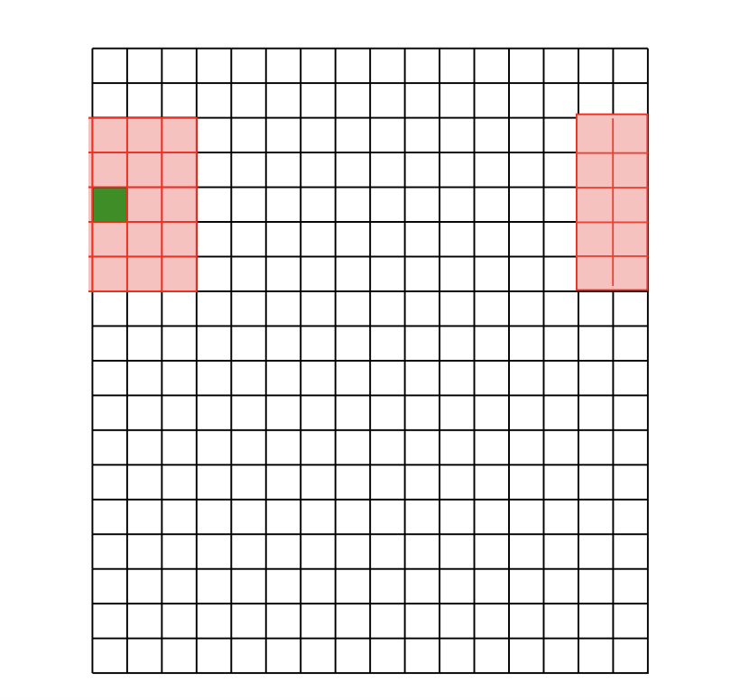
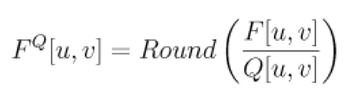
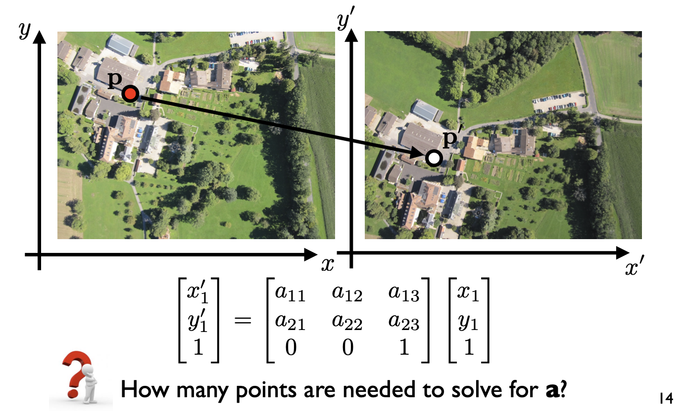
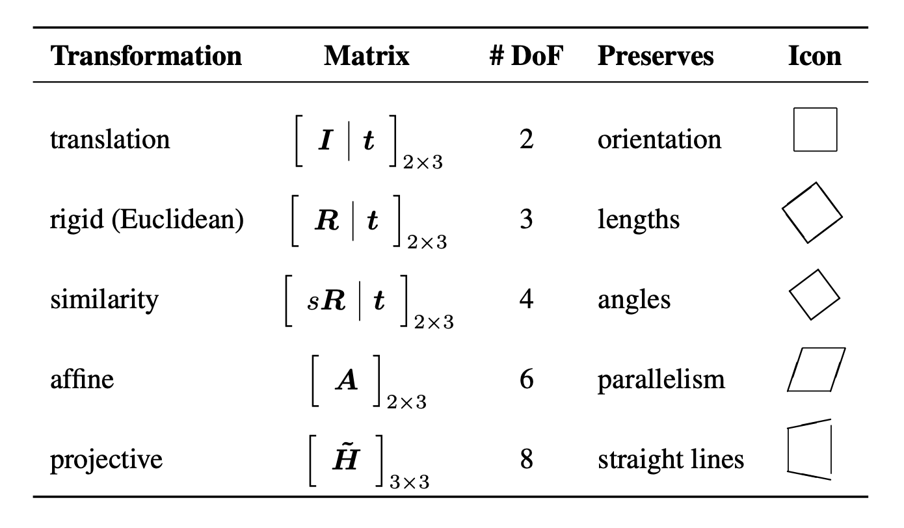
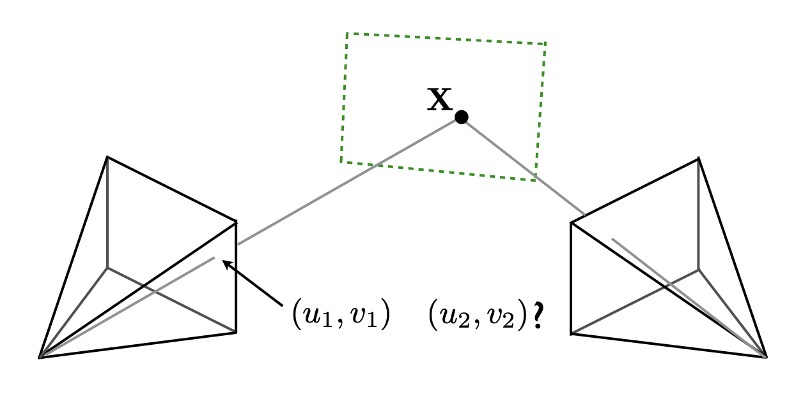
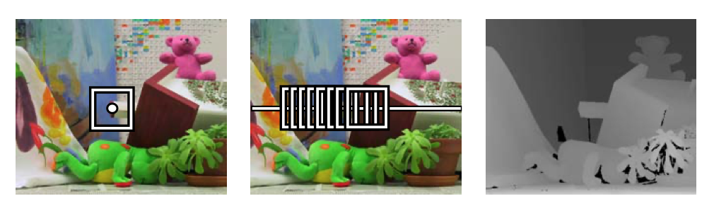
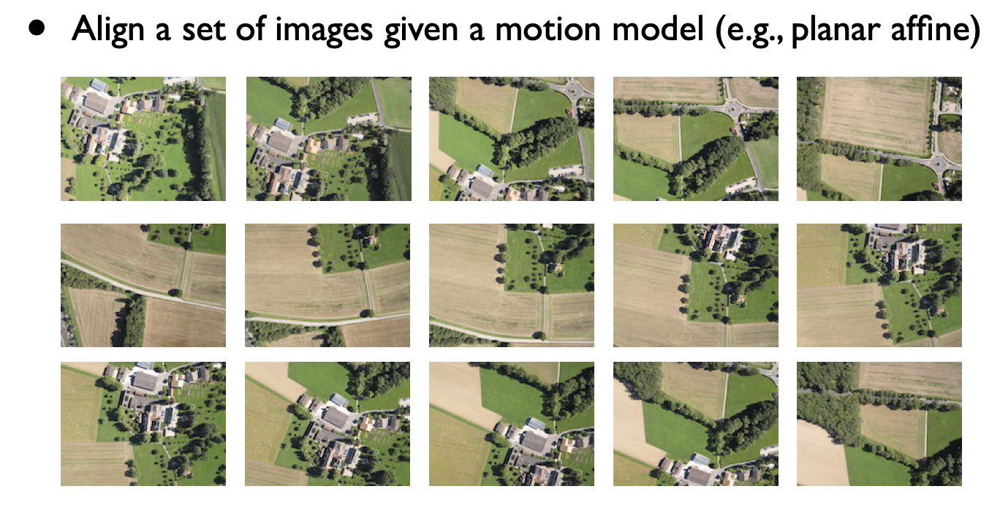
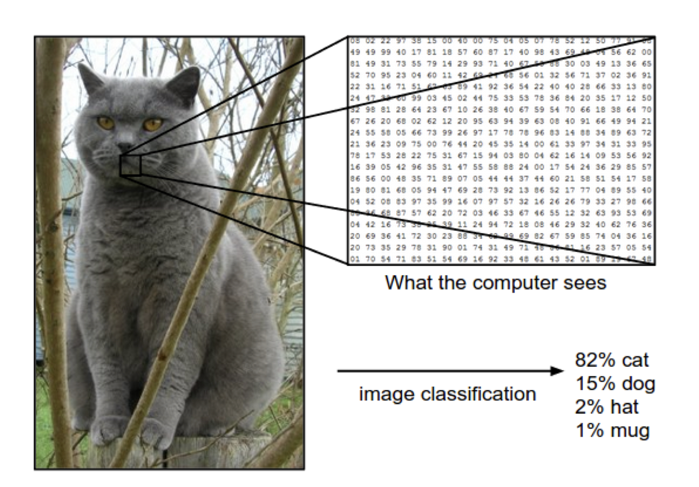
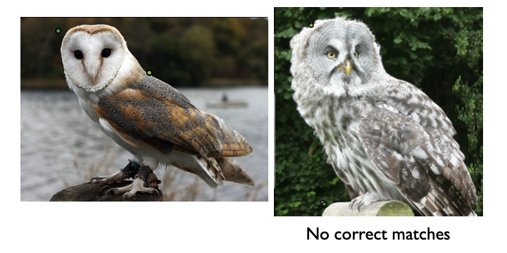

# Image Formation, Camera and Lenses

## Surface Reflection

- pictures as we know them are made up of discrete colour or intensity values

  - they're related to things such as surface properties and geometry, camera optics and sensor properties

- <u>**diffuse reflection**</u>

  - aka Lambertian or matte reflection &rightarrow; phenomenon we usually associate with shading 

  - the amount of light reaching the unit surface area depends on the angle between the light and the surface

    	

    - it's hard to calculate the intensity of the rays reflected (because there's so many), so instead we observe the intensity at the contact surface
    - the observed intensity is dependent on the width of the ray (it gets bigger as we stray from the normal - see the right ray) &rightarrow; and this is why we get shadding 

  - so the intensity observed is independent of the viewer's position (because light is reflected everywhere), instead it's dependent on the angle of incident of the light ray

    	
    $$
    \begin{align*}
    \text{at surface, } I_D &= \dfrac{\text{light power}}{\text{length}} \\
    &= \dfrac{p}{\frac{1}{\cos \theta}} = p \cdot cos \theta \\
    \therefore I_D &= k_d \cdot i_d \cdot \cos \theta \\
    \\
    I_D &= \text{observed intensity}\\
    i_d &= \text{initial intensity at the source}\\
    k_d &= \text{diffuse reflection coefficient} \\
    \end{align*}
    $$

    - the "length" here is the width of the array at the contact area that were were talking about (see $1/\cos \theta$ above)

- <u>**specular reflection**</u>

  - also known as gloss or highlight reflection

    	

  - light reflected strongly around the mirror reflection direction

  - intensity depends heavily on the viewer's position

    	
    $$
    \begin{align*}
    I_S &= k_s \cdot i_s \cdot \cos^{\alpha} \theta
    \\
    \\
    k_s &= \text{specular reflection coefficient} \\
    i_s &= \text{specular light power} \\ 
    \alpha &= \text{shininess}
    \end{align*}
    $$

  - note: it is not exactly the same as mirror reflection

    - a mirror reflection is a subset of specular reflection &rightarrow; that specifically refers to the reflection of light off a perfectly smooth and flat mirror-like surface
    - in pure mirror reflection, the angle of incidence is precisely equal to the angle of reflection, and the reflected image is sharp and undistorted

- Phong illumination model: used to model surfaces with all these properties

  - consist of three main components: ambient, diffuse, and specular reflection

  - ambient reflection represents the constant, uniform light that is scattered and reflected by surfaces in all directions

  - not dependent on the direction of the incoming light or the viewer's perspective

    	

  - so the formula is made up of the formula for each part (ambient, diffuse, specular) - 2 of which we've talked about already 
    $$
    \begin{align*}
    I_{\text{total}} &= k_a i_a + k_d i_d \cos \theta + k_s i_s \cos^{\alpha} \phi \\ 
    \\
    k_a &= \text{ambient reflection coefficient} \\
    i_a &= \text{intensity of the ambient light source} \\
    k_d &= \text{diffuse reflection coefficient} \\
    i_d &= \text{intenisty of the diffuse light source} \\
    k_s &= \text{specular reflection coefficient} \\
    i_s &= \text{intesnity of the specular light source}
    \end{align*}
    $$

    - note: it's possible for $i_a = i_d = i_s$ if they are all coming from the same light source?
    - TODO: confirm with TA tomorrow

## Cameras

- <u>**Pinhole Cameras**</u> (Perspective Projection)

  	

  - the idea: you're blocking out all the lights from other sources OTHER than the object that you're interested, as the light from those objects enter the pinhole - you form an image that's laterally inverted

  - in the 2D case, you are trying to capture a 2D object to a 1D plane (some kind of projection)

    	

    - the math in 2D - via similar triangles
      $$
      \dfrac{x^\prime}{f^\prime} = \dfrac x z
      $$

      - you can flip this around and work with it as needed
      - $f^\prime$ here is the focal length which is the distance between the image plane (photosensitive material) and the aperture (the pinhole/lens) - see below

  - in 3D: you are trying to capture a 3D object to a 2D plane (i.e a photograph)
    $$
    P = \begin{bmatrix}x \\ y \\ z\end{bmatrix} \text{~projects to 2D image point } P^\prime = \begin{bmatrix}x' \\ y'\end{bmatrix} \text{ where } \begin{cases}
    x^\prime = f^\prime ~\dfrac x z \\ \\
    y^\prime = f^\prime ~\dfrac{y}z
    \end{cases}
    $$

  - matrix form, you can also define a Camera matrix $C$ 
    $$
    \begin{align*}
    P &= \begin{bmatrix}x \\ y \\ z \\ 1 \end{bmatrix} \text{~projects to 2D image point } P^\prime = \begin{bmatrix}x' \\ y' \\ 1\end{bmatrix} \text{ where } s P^\prime = CP \\\\
    s&= \text{scale factor} \\\\ 
    C &= \begin{bmatrix}
    f^\prime &0 &0 &0\\
    0 &f^\prime &0 &0 \\
    0 &0 &1  &0
    \end{bmatrix}
    \end{align*}
    $$

    - note: after doing the matrix multiplication, you will have $P^\prime = [x^\prime ~ y ^\prime ~s]$ so you need to divide everything by $s$

    - note: this is for a pinhole system, in the lens system, we have to slightly modify the camera matrix
      $$
      C &= \begin{bmatrix}
      f_x^\prime &0 &0 &c_x\\
      0 &f_y^\prime &0 &c_y \\
      0 &0 &1  &0
      \end{bmatrix}
      $$

  - when you do this kind of projection, you try to simulate the feeling of 'depth' by altering the projected points a bit on the image surface (i.e vanishing points)

    - so the result of this projection is a "perspective-correct" projection, where objects closer to the camera appears larger and more distant objects appear smaller

- <u>for a fixed sensor size, focal length determines the filed of view (FOV)</u>

  	

  - FOV **the range of the observable world visible at any given time through the human eye, a camera viewfinder or on a display screen**

  - <u>**bigger focal length &rightarrow; smaller FOV**</u>

  - the equation for $\theta$
    $$
    \begin{align*}
    \tan \left(\dfrac \theta 2 \right) &= \dfrac w {2f} \\
    \theta &= 2 \arctan\left(\dfrac w {2f}\right) \\
    \\
    w &= \text{sensor (diagonal) size} \\
    f &= \text{focal length}
    \end{align*}
    $$

  - example: What is the field of view of a full frame (35mm) camera with a 50mm lens?
    $$
    \begin{align*}
    w &= 35 mm \\
    f &= 50 mm \\
    \theta &= 2 \arctan\left(\dfrac{35}{100}\right) = 38.6 \degree
    \end{align*}
    $$

- <u>**Orthographic Projection**</u>

  - also another way to project 3D point (called $P=(x,y,z)$) onto a 2D plane 

  - we do not consider $z$ component of $P$ (in a sense, flattening it) &rightarrow; basically just taking the point $P$ and removing the $z$ coordinates
    $$
    \text{3D object point } P = \begin{bmatrix}x \\ y \\ z \end{bmatrix} \text{ projects to the 2D image point }  P^\prime = \begin{bmatrix}x ^\prime \\ y^\prime \end{bmatrix} \text{ where } 
    \begin{cases}
    x^\prime = x \\
    y^\prime = y
    \end{cases}
    $$

- <u>**Weak Perspective Projection**</u>

  - also known as <u>Scaled Orthographic Projection</u>

  - again, trying to project 3D point $P = (x,y,z)$ onto a 2D plane

  - this is trying to "replicate" the depth perspective in the perspective projection, we do this by basically getting rid of the $z$ value and scaling both $x$ and $y$ by some constant $m$
    $$
    \begin{align*}
    \text{3D object point } P &= \begin{bmatrix}x \\ y \\ z \end{bmatrix} \text{ projects to the 2D image point }  P^\prime = \begin{bmatrix}x ^\prime \\ y^\prime \end{bmatrix} \text{ where } 
    \begin{cases}
    x^\prime = mx \\
    y^\prime = my
    \end{cases} \\\\
    
    m &= \dfrac {f^\prime}{z_0} \\
    z_0 &= \text{some constant}
    
    \end{align*}
    $$

    - $z_0$ is distance from the image to the object, but this cannot be changed

  - it is a kind of way to "approximate" perspective projection because it simplifies the projection process

    - good for when depth variation is small (i.e image is kinda close to the camera)

- comparison between projections 

  - weak perspective has simpler math
    - accurate when object is small and/or constant
    - useful for recognition
  - perspective is more accurate for real scenes
    - <u>**is used in cameras**</u>
  - overall, if given a projection matrix, multiply that with the current point vector to get the projected point (divide by $w$ if necessary)

- why not pinhole camera

  - if pinhole is too big then light from too many directions are averaged, blurring the image 
  - if pinhole is too small then diffraction (light spreads as it hits a obstruction - i.e the pinhole) becomes a factor, also blurring the image

  - generally, pinhole cameras are dark, because only a very small set of rays from a particular scene point hits the image plane 

  - also, pinhole cameras are slow
    - due to their limited light-gathering abilities, pinhole cameras are slow in the sense that they require longer exposure times to accumulate enough light to form a discernible image

- a real camera must have a finite (non-tiny) aperture to get enough light - but this causes blur in the image

  - solution: use a lens to focus the light onto the image plane

    	

  - lenses work because of Snells' law - which states that light bends when it goes through different materials 

    	

    - apparently the **change of direction is caused by a change in speed** in which light travels between two surfaces

- lens basic: a lens focus rays from infinity at the focal length of the lens

  	

  - you can see that in this example, the image plane is too close to the lens, so light is not gathering correctly on that plane &rightarrow; causing blur, to fix, we need to move image plane back to the dotted blue line

  - the lens equation

    	

    - $f$ is the focal length (on top) - this is a property of the lenses and we usually don't have control over this

    - we're usually given $y$ and $z$ and we want to find how far behind the length will the image appear ($z'$)
      $$
      \begin{align*}
      \dfrac {y'} y  &= \dfrac{z'}{z} = \dfrac{z' - f}{f} \\\\
      \dfrac 1 z &= \dfrac 1 f - \dfrac 1 {z'}\\
      \dfrac 1 f &= \dfrac 1 {z'} + \dfrac 1 {z}
      \end{align*}
      $$

  - example: A 50mm lens is focused at infinity. It now moves to focus on something 5m away. How far does the lens move?

    - at the start (when it's focused at infinity) - the convergence point (or $z^\prime_\text{old}$) is $f$ (in this case 50mm)

    - after focussing on something closer, the convergence point is now $z'$

    - we're interested in the difference between $z'$ and $f$
      $$
      \begin{align*}
      \dfrac 1 {z^\prime} + \dfrac 1 z &= \dfrac 1 f \\
      \dfrac 1 {z^\prime} &= \dfrac{1}{0.05}  - \dfrac 1 5 \\
      z ^\prime &= 19.8 \\
      \\
      d &= z' - f = \dfrac 1 {19.8} - 0.05 \approx 0.5 \text{ mm }
      
      \end{align*}
      $$

  - lens focus <u>all rays from a plane in the world</u> (called plane of focus) - objects off that plane are blurred depending distance

    	

    - brings in the idea of Depth of Field (DOF) - refers to the range of distances within a scene that appear acceptably sharp and in focus in an image

    - a factor that affects DOF is aperture size - ==smaller aperture = smaller blur, larger depth of field==

      		

    - example - see that larger apertures have less stuff in focus

       

- real lens are not infinitely thin - so they suffer from <u>**geometric aberrations**</u>

  - we will have to correct for them 

  - this is why real camera lenses have multiple stages (lens) of positive and negative elements with differing refractive indices

  - <u>**Chromatic Aberrations**</u>

    	

    - the index of refraction for glass varies slightly as a function of wavelength 

    - summary: light of different colours (wavelength) bend differently when it goes through a lens &rightarrow; causes light to focus at different distances &rightarrow; image may shift in position and lose its sharpness

    - most lenses today are compound lenses made of different glass elements that helps focus those wavelengths correctly

      	

  - <u>**Vignetting**</u> 

    	

    - occurs when rays of light get blocked or obstructed inside the outer edges of multiple lenses in a compound lens

      - in other words: happens because the light entering the camera lens is often more evenly distributed toward the center of the frame

    - can be decreased by reducing the camera aperture (increasing the f-number)

    - makes the edges of images look darker

      	


# Image Filtering

- how images are represented

  - grayscale: can be represented as a 2D function
    - it's a 2D array where `arr[x][y]` gives a value between 0 (black) to 255 (white)
  - RGB: images are 3D function
    - it's a 3D array where `arr[x][y][r/g/b]` which gives values for red, green, and blue channels

- point operation filtering: simplest kinds of image processing transforms are *point operators*

  - each output pixel's value depend on the input pixel value

  - ex. brightness and contrast adjustments or colour corrections and transformations

  - some example

    	

  - the thing above (multiplicative gain) is a linear operation, meaning it follows the superposition principle
    $$
    h(f_0 + f_1) = h(f_0) + h(f_1)
    $$

    - that is if you apply this operation to the sum of two parts of an image, it's the same as applying the operation to each part separately and then adding the results together
    - note: things like squaring an image intensity IS NOT a linear operation

- gamma correction:

  - highly used <u>non-linear</u> operation

  - done to fix the way the camera maps the real-world brightness to the pixel values in the image &rightarrow; un-doing the camera's way of seeing light

  - to invert gamma mapping applied by the sensor, we can use
    $$
    g(x) = [f(x)]^{1/\gamma} ~~~~~~ \gamma \approx 2.2
    $$

- colour transforms

  - colour images can be quite complex, but it's often helpful to think of them as closely related to how we perceive colours and how cameras capture them
    - ex. if you want to make an image look brighter by simply adding the same amount of brightness to each colour, it's not just about making it brighter, it can also change the way the colours look
  - similarly, colour balancing (like adjusting colours to look right under different lighting conditions) can be performed by multiplying each channel with a different scale factor

- neighbourhood operation filtering

  - we are applying operators to local neighbours

     

  - an output pixel’s value is a weighted sum of pixel values within a small neighbourhood $N$

## Linear Filtering: Correlation

- correlation: apply a element-wise multiplication between the filter and the neighbourhood around the point and sum that up (some call it the element-wise dot product)

  	

  - reminder: element wise dot product

    	

  - for convienience - we should make the size of the filter odd (so that there's a notion of a "center")

- example in 1D

  	

- the math in 2D
  $$
  I^\prime (X, Y) = \sum^k_{j=-k} \sum^k_{i = -k} F(i, j) I(X +i, Y+j)
  $$

  - (this is assuming a square filter)
  - note that $k = \lfloor \text{filter size / 2} \rfloor$ &rightarrow; so for a $(3 \times 3)$ matrix, $k = 1$

- boundary effects: there is not enough values at the boundaries to do computation - there are some things you can do 

  - <u>ignore these locations</u>: make the computation undefined for the top and bottom $k$ rows and the leftmost and rightmost $k$ columns &rightarrow; the resulting image will be smaller

    - basically start the correlation where you actually can fully fit the filter and go from there

  - <u>zero padding</u>: put 0s all around the boundary

    	

    - the resulting image will be the same size as original image
    - problem: this can decrease brightness around the edges of the image

  - <u>assume periodicity</u>: the top row wraps around to the bottom row; the leftmost column wraps around to the rightmost column

    	

  - TODO: full mode??

- convolution vs correlation
  $$
  \begin{align*}
  \text{Correlation}: I^\prime (X, Y) &= \sum^k_{j=-k}\sum^k_{i = -k} F(i, j) \cdot I(X +i, Y+j) \\\\
  \text{Convolution}: I^\prime(X, Y) &= \sum^k_{j=-k} \sum^k_{i = -k} F(i, j) \cdot I(X-i, Y-i) \\
  &= \sum^k_{j=-k} \sum^k_{i = -k}F(-i, -j) \cdot I(X+i, Y+i)
  
  \end{align*}
  $$

  - in layman terms: convolution is correlation if the filter was flipped twice (vertically and horizontally)

     	

    - $180^\circ$ degrees rotation of the kernel

  - really good example: https://medium.com/@aybukeyalcinerr/correlation-vs-convolution-filtering-2711d8bb3666

- convolutions has some nice properties

  - linear
    $$
    \begin{align*}
    (\alpha_1F_1 + \alpha_2 F_2) \times F_3 &= \alpha_1 F_1F_3 + \alpha_2F_2F_3
    \end{align*}
    $$

    - both correlation and convolution are linear operations

  - associative
    $$
    (a \times b) \times c = a \times ( b \times c)
    $$

    - both correlation and convolutions are associative 

  - not quite commutative

    - convolution **is commutative** while correlation is not

- more properties on convolutions: let $\circledast$ denote convolution and let $I(X,Y)$ be a digital image and $F$ be the filters

  - <u>Superposition principle</u>
    $$
    (F_1 + F_2) \circledast I(X,Y) = F_1 \circledast I(X,Y) + F_2 \circledast I(X,Y)
    $$

  - <u>Scaling</u>: let $k$ be a scalar
    $$
    (k F) \circledast I(X,Y) = F \circledast (kI(X,Y)) = k(F \circledast I(X,Y))
    $$

  - <u>Shift invariance</u>: the output is local (no dependence on absolute position)

    - <u>therefore any linear, shift invariant operation can be expressed as convolution</u>

  - <u>the convolution/correlation operator satisfy all of this</u>

  -  it is also linear-shift invariant (LSI) operators

    - it's called this because it is linear (i.e satisfy superposition principle) and is shift invariance

## Linear Filters (Box, Pillbox, Gaussian)

- Box Filter
  $$
  \dfrac 1 9 \begin{bmatrix}
  1 & 1 & 1\\
  1 & 1 & 1\\
  1 & 1 & 1
  \end{bmatrix}
  $$

  - filter has equal positive values that all sum up to 1

  - replaces each pixel with the average of itself and its local neighbourhood

  - sometimes called the average or mean filter

    	

  - filters sum to 1 because it **preserves the mean of the filtered image**

  - in reality - box filter does not model lens defocus well (because it just averages, while lens introduce a more complex blur)

  - smoothing with a box filter depends on direction &rightarrow; bad

    - if you apply it vertically (go up and down), it will blur more in the vertical direction
    - while camera lens applies a more uniform blur

- Pillbox Filter

  - let the diameter of the filter be $r$

  - a 2D (circular)pillbox filter $f(x,y)$ is defined as 
    $$
    f(x,y) = \dfrac 1 {\pi r^2} 
    \begin{cases}
    1  & \text{if } x^2 + y^2 \leq r^2 \\
    \\ 0 & \text{otherwise}
    \end{cases}
    $$

    - the scaling constant $\dfrac 1 {\pi r^2}$ makes sure the area of the filter is 1 (same as the box filter above)

  - example

    	

    - for every star, there's a stamp of a circle in the output

- <u>**Gaussian Filter**</u>

  - this is the most common

  - Gaussian formula
    $$
    \begin{align*}
    \text{in 1D: }~G(x) &= \dfrac 1 {\sqrt{2 \pi} \sigma} \cdot \exp\left(-\dfrac 1 2 \left(\dfrac x \sigma \right)^2 \right) \\ 
    \text{in 2D: }~G(x, y) &= \dfrac 1 {2 \pi \sigma^2} \cdot \exp \left( - \dfrac  1 2 \left(\dfrac{x^2 + y^2}{\sigma^2}\right) \right) \\ 
    &= G(x)\cdot G(y)
    \end{align*}
    $$

    - note that 2D Gaussian is the same as the product of 2-1D Gaussians
    - recall: $\sigma$ is the standard deviation ($\sigma^2$ is the variance)

  - main idea: weight contributions of pixels by special proximity (nearness) to the center point

    - the the pixels "matter" more if they're nearer to the center

  - picking $\sigma$

    - larger $\sigma$ means more blurring
    - we also want our filter to sum up to 1 - so the filter has to be big enough
      - thus the SIZE OF THE FILTER DEPENDS ON $\sigma$
      - `size(filter) = 6σ` (i.e $k = 3 \sigma$)

  - building a Gaussian kernel: basically - you make the box, label the coordinates with the center cell as $(0,0)$ then plug those coordinates into the Gaussian - get the values &rightarrow; at the end, normalize everything so that it sums up to one (divide everything by the sum of the filter)

- low pass filters

  - all smoothing filters are low-pass filters
    - when you apply a smoothing filter to an image or signal, it functions as a low-pass filter because it reduces high-frequency components (high-frequency noise or fine details) while allowing low-frequency components (the overall structure and general features) to pass through
  - more details: why a Gaussian filter is considered a low-pass filter

    - the Fourier transform (FT) of a Gaussian is also a Gaussian
    - the FT of a convolution is a product.
    - Thus the FT of the convolution of an image with a Gaussian is the product of the FT of this image with a Gaussian, which has its higher frequencies multiplied by a small number (exponential of a big negative number)

## Efficiency (Separable Filtering)

- separability: a 2D function of $x$ and $y$ is separable if it can be written as product of function of $x$ and function of $y$

  - more technical terms a 2D function of $x$ and $y$ is separable if it can be written as product of function of $x$ and function of $y$
    $$
    K = \textbf{v} \textbf{h} ^T
    $$

  - box 2D box filters and 2D Gaussian filters are separable

    - separable filters can be implemented as 2 1D convolutions
      - first, convolve each row with a 1D filter
      - then, convolve each row with a 2D filter
      - or vice versa

  - note: 2D Gaussian is the only non trivial 2D function that's both separable and rotationally invariant 

    - so A **2D pillbox** is rotationally invariant but not separable

- rebuilding 2D Gaussian from separated from 1D Gaussian

  	

  	

  - you convolve the 1D Gaussian with itself (using the `full` setting) - this makes it so that it does $2(k-1)$ zero padding 
  - you can see that the number of rows increased by $2(5-1) = +8$

- perfomance comparison 

  	

  - it's also better on memory (storing 2 small filter instead of 1 big one)

- I do not believe we'd be asked to deconstruct via SVD, but you can do guess and check

  - (at least if given 1 of the vectors, you should be able to figure out the other one via <u>outer product</u> guess and check)

  - ==important example==: Sobel filter

     

  - outer product

    	

- multiple filters: sometimes you can chain kernels together to make even bigger kernels

  - ex. two box kernels

     

  - code

    ```python
    filter = [
        [1.0,1.0,1.0],
        [1.0,1.0,1.0],
        [1.0,1.0,1.0]
    ]
    filter = np.array(filter)
    filter *= (1/9)
    signal.correlate2d(filter, filter,"full")
    ```

  - this is better for efficiency than having that 1 big kernel

  - performance 

    

    - so separable filters are always ideal but not always the possible, so decomp-ing them will be a good idea

## Non-Linear Filtering

- in many cases, better performance can be obtained by using a *non-linear* combination of neighbouring pixels. 

  - ex. for image e) below, there is "shot noise" (i.e it occasionally has very large value) - regular blurring w/ Gaussian will fail and just turn them into softer (but still visible spots)

    	

- the more important thing is that the non-linear filters **that we will look at** are <u>edge preserving</u>

  - they have a tendency to only soften edges while filtering away high-freq noise

- <u>**Median Filter**</u>

  - which selects the median value from each pixel’s neighbourhood

    	

  - since the shot noise value usually lies well outside the true values in the neighborhood, the median filter is able to filter away such bad pixels

  - however, it is bad at getting rid of regular Gaussian noise &rightarrow; you can look into doing a weighted median or smt in that case

- <u>**Bilateral Filtering**</u>

  - suppose we want to smooth a noisy step function

    	

    - a Gaussian filter will average points from both the top and bottom of the step 

    - Bilateral Filter idea: look at the distance in range (value) as well as. space `(x, y)` &rightarrow; only blend pixels together if they are close in value and in space

  - basically: is a method used in image processing to smooth or blur an image while preserving edges and fine details

  - details: works by applying a weighted average to the pixels in the neighborhood of each pixel in the image

    -  weight for each pixel depends on both its spatial proximity to the center pixel and its similarity in intensity or colour to the center pixel

  - so the formula includes both a <u>domain/spatial kernel</u> (weights based on how far it is from the center point) and <u>range/intensity kernel</u> (weights based on how close in values it is to the center kernel)
    $$
    B(x, y) = \underbrace{\exp\left(-\dfrac{x^2 + y^2}{2 \sigma_d^2}\right)}_\text{domain kernel}\times \underbrace{\exp \left(- \dfrac{[I(X+x, Y+ y) - I(X,Y)]^2}{2\sigma^2_r} \right)}_{\text{range kernel}}
    $$

    - note the 2 different $\sigma_i$

  - example

    	

     

  - running the example above with the bilateral filter vs Gaussian filter only

    	

- <u>**reLU**</u>

  - used in CNN 

  - point: ReLU **introduces the property of non-linearity to a deep learning model and solves the vanishing gradients issue**

    - so if we had some linear filter and we wanted to make it non-linear, we can do reLU

  - in NN linear filters can be applied as a matrix multiply $y=Ax$

    - but when we want to introduce some non-linearity to it, we can do $y = \text{relu}(Ax)$

  - the reLU activation function is defined as 
    $$
    f(x) = \max(0, x)
    $$

    - basically just turns any negative inputs to 0, and keep the positive outputs

  - example

    	


## Sampling

- sampling: take continuous function and convert them to a digital signal

  - if you have a continuous function with waves, how can you get a digital signal 
  - also how can we manipulate (i.e resample) the digital signal correctly
  - image sampling is *the process of capturing discrete pixels from a continuous image and quantization*

- background: an image resolution is the size of the image (ex 1920 by 1080 pixels), if you want to shrink the image (i.e to 1080 by 720 pixels), you will have to throw away pixels

  - naive method: form new image by selecting every $n$th pixel (we get very bad results)

      

    - this is bad because we're missing intermediate pixels in between the white dots
    - throwing away information and we can see there are some artifacts (called aliasing)

  - new method: blur before down sampling

     

    - this helps a bit
    - instead of throwing away info, we've combined them first, and so we capture more of them as we downsample	

- example: audio sampling

  	

  - choices we can make when sampling: how long we wait in time before "recording" the number
    - sampling frequencies and bit depth (how many bits are we using to represent each sample)

- kind of error

  - aliasing: missing information (the mountain above)

    - note: we can help with this by pre-filtering with a low-pass filter

  - quantization error: from inaccuracies because of the discrete numbers (see the gaps below)

    	

- <u>**Nyquist sampling theory**</u>: to avoid aliasing a signal must be sampled at twice the maximum frequency
  $$
  \begin{align*}
  f_s &> 2 \times f_{\text{max}}
  \\\\
  f_s &=  \text{sample frequency} \\
  f_\text{max} &= \text{maximum frequency}
  \end{align*}
  $$

  - a signal is **<u>exactly recoverable</u>** from its samples if it sampled at the Nyquist rate (or higher)

  - note: a signal must be band-limited for this to apply (i.e it has to have a max freq)

    - most things that we perceived are band-limited - i.e frequency of which we can hear music and see actual lightwaves	

  - need to sample *twice as fast* as the maximum frequency

  - example

    	

    - frequency of the cosine wave is 1/8 hz - but we call it T
    - if you sample at $f_s \geq 2f \rightarrow Ts \leq T/2$ then you won't suffer from aliases
      - see the Xs, that's the places you have to sample from

  - for images, to avoid sampling and obey the Nyquist rule, **<u>you need to sample once per pixel</u>**

- ways to prevent aliasing as you are sampling

  1. sample more frequently (oversampling)
  2. reduce the maximum frequency via a low pass filter (smooth before sampling)

## Camera Corrections

- background on camera's digital sensors

  - RGB filters are arranged in a Bayer pattern (aka mosaic pattern) &rightarrow; that is each cell is only sensitive to either red, green or blue light 

     

  - so we need to "de-mosaic": for the red and blue cells let say, the green value for that cell is interpolated from neighbouring green cells &rightarrow; use bilinear interpolation

  - <u>**bilinear interpolation**</u>: average of the neighbours

     

    - simple interpolation algorithm like bilinear causes some artifacts - but there are state of the art ones that does a much better job
    - note: <u>we use this sometimes when we upsample too</u>

- colour as we know it is how we subjectively perceive the wavelengths of light

  - it's also heavily dependent on the context and the rest of the scene

- colour/white balancing 

  - many cameras adjust the colors in the images they capture to make white look truly white (with equal RGB values)

    - this is because humans are good at adapting to global illumination conditions: you would still describe a white object as white whether under blue sky or candle light (i.e snow is actually blue-ish but due to the sun, it appears white to us)
    - however, when the picture is viewed later, the viewer is no longer correcting for the environment and the illuminant colour typically appears too strong

  - white balancing is the process of correcting for the illuminant

  - a simple algorithm just kinda scales the RGB channels independently by some factors
    $$
    \begin{bmatrix} 
    p_1 \\ p_2 \\ p_3
    \end{bmatrix}^\prime = 
    \begin{bmatrix}
    \lambda_1 &0 &0 \\
    0 &\lambda_2 &0 \\
    0 &0 &\lambda_3
    \end{bmatrix} 
    \begin{bmatrix} 
    p_1 \\ p_2 \\ p_3
    \end{bmatrix}
    $$

- gamma correction

  - equal changes in luminance (raw pixel values) do not correspond to equal changes in perceived brightness by the human visual system

  - so we encode pixel values $V$ using a power law
    $$
    L = V^\gamma
    $$

    - $L$: the perceived brightness of the image - the gamme correction porcess adjusts the pixel values $V$ to make the image appear with the desired luminance
    - $V$: represent raw pixel values of the image
    - so the camera stores $V$ because that's what it captured (also more efficient), but when we display the image, we want to scale $V$ using the power rule and display $L$ because that's the perceived brightness

- contrast sensitivity

  - humans are most sensitive to mid-frequencies

  - so we want to either "throw away" the high frequencies or quantize them heavily

  - Discrete Cosine Transform (DCT)

    - JPEG uses a set of 8x8 basis functions for representing images, these basis functions are like building blocks for image compression
    - The DCT basis functions are designed in such a way that most of the image energy is concentrated in the low-frequency components (the upper-left corner of the 8x8 block)
    - and the DCT is efficient to compute
    - trying to translate to frequency domain

  - Coefficient Quantizations

    - DCT coefficients $F(u, v)$ are quantized according to a quantization table

      - these coefficients represent how much each basis function contributes to the image

    - quantization table entries determine the “lossiness” of the compression

      	

    - the result is the division of the transformed DCT coefficients by the quantization matrix

      	

    - this step is how you're quantizing or getting rid of a high/low frequencies - keep the mid frequencies

    - bit like band pass 

  - don't worry too much about this

# Image Pyramids (Scaled Representations)

## Gaussian Pyramids

- sometimes we just want to lower the resolution

  - ex. downsizing an image to fit on a phone
  - ex. we want a lower resolution image so we can run some quick computation to see if it works before committing to running on the full resolution
  - recall our sampling problem from before where it was suggested that you blur before down sampling

- the process to do this is to first blur the picture, then sample every 2nd pixel - reducing the resolution by half &rightarrow; rinse and repeat

   

  - note that you are losing some information by doing this (DOES NOT get rid of aliasing - just helps)

- further question

  	

- practically: to "avoid" aliasing, for every image reduction of 0.5, smooth by $\sigma = 1$ 

- summary:

  - each level represents a low-pass filtered image at a different scale
  - generated by successive Gaussian blurring and downsampling
  - useful for image resizing, sampling


## Laplacian Pyramids

- Laplacian pyramids is generated from a different way but <u>starts from Gaussian pyramid</u>

  - you take a lower level, upsample it so it's the "same resolution" as the bigger level

  - then you difference it with the bigger level

    	

    - note: only the first picture is laplacian currently
    - but you can see that it's whatever that was lost from the Gaussian blue and downsample process - which are high frequencies details 

  - more mathematical terms

    	

    - you can think of at every level of the Gaussian, you blur that image, then subtract the "original" from the blurred version 

    - so basically, the laplacian tells you what information you are getting rid of in the process of downscaling &rightarrow; <u>**it is a band pass filter**</u> (each level represents a different band of spatial frequencies)

  - rinse and repeat you get 

    	

    - you leave the last one the same (because you have nothing to upsample from)

- reconstructing the original image

  - this is <u>not possible</u> with the Gaussian pyramid

  - it is possible if you have Laplacian pyramid

  - have a running sum of sort

    - upsample from the last level
    - sum it with the residual of the next level
    - rinse and repeat

  - math (I think)
    $$
    \text{Gaussian}_k = \text{Upsample Gaussian} _{k-1} + \text{Laplacian}_k
    $$

    - this looks very obvious but the cool thing is that we don't actually need the Gaussian pyramid, since <u>the last level of the Laplacian is already a Gaussian</u>
    - we we're basically rebuilding the Gaussian pyramid from the Laplacian until we get to the original resolution

  - algorithm looks something like 

     

-  summary:

  - each level is a band-pass image at a different scale
  - generated by differences between successive levels of a Gaussian Pyramid
  - used for pyramid blending, feature extraction etc

- <u>**important note**</u>: 

  - though we call it here a "Laplacian" - this is sloppy naming
  - the actual Laplacian Pyramid is called Laplacian of Gaussian (LoG) pyramid
    - because we blur (apply Gaussian Filter)
    - then we get the 2nd derivative (apply the Laplacian Filter)
  - the method we describe here is called the Difference of Gaussian pyramid - which means at a level, you can blur then subtract original image on that level with the blurred image of itself
  - this works because DoG very closely resembles LoG in the Fourier domain

## Application: Image Blending

- we can use Laplacian pyramids to create blended composite images

  	

  - a) is the apple, b) is the orange, c) is the slice of them together and d) is the blended image of them

- first, each source image is decomposed into its own Laplacian

- each band is then multiplied by a smooth weighting function whose extent is proportional to the pyramid level

  - simplest way is to take a binary mask image (parts you want to keep, leave out) and then construct a Gaussian pyramid from this mask

- each Laplacian pyramid image is then multiplied by its corresponding Gaussian mask and the sum of these two weighted pyramids is then used to construct the final image

> Steps
>
> 1. Create Laplacian Pyramids: create laplacian pyramid for both of your images
> 2. Blend at Each Pyramid Level: starting from highest level of pyramid, blend the corresponding levels of the image pyramids (done by taking weighted average of the two pyramid levels &rightarrow; multiply by their respective mask in the slides)
> 3. Upsample and Add: after blending, upsample the blended result to match dimensions of next higher level, then add it to he corresponding pyramid level of the other image
>
> 

# Template Matching

## Template Matching

- <u>**this works because filters cause spikes to things that looks like it**</u> (see 340)

- say we want to identify all faces, we take a face then correlate that with the image

  	

  - non-max suppression is comparing each local maximum with its neighbouring pixels, typically in a defined region or window &rightarrow; if the local maximum is greater than its neighbours, it is retained; otherwise, it is suppressed (set to zero or a lower value)

  - picking out the maximum values

    	

- this naive approach won't work with for a more complex situation (multi-scale template matching)

  	

  - the first face is too big
  - see multi-scale template matching later 

- template matching: you do correlation between the image and the target/template that you're trying to detect

  	

  -  when you pass it through the point, what spikes the most are things that "looks like" the filter

  - doesn't work when things are not normalized &rightarrow; dot product might be large simply because that region is bright - <u>**need to normalize**</u>

    	

    - we'd say that patch 2 is MUCH MORE similar to the template, but in fact that's not the case
    - basically - trying to match by SHAPE and not INTENSITY

- different kind of correlation: so template matching is basically the similarity measures between a filter $\textbf{J}$ and local image region $\textbf{I}$

  - normal correlation
    $$
    \text{CORR} = \textbf{I} \cdot \textbf{J} = \textbf{I}^T \textbf{J}
    $$

  - normalized correlation
    $$
    \begin{align*}
    \text{NCORR} &= \dfrac{\textbf{I}^T \textbf{J}}{\abs{\textbf{I}} \abs{\textbf{J}}} = \cos \theta\\ 
    \textbf{I}^T \textbf{J} &= \abs{\textbf{I}} \abs{\textbf{J}} \cos \theta \\
    \\
    \abs{\textbf{I}} &= \sqrt{\sum_i \textbf{I}_i^{~2}} 
    \end{align*}
    $$

    - just divide by the magnitude
    - the values varies between $[-1, 1]$ &rightarrow; 1 means the filter and image region are identical (up to a scale factor)
    - this is a bit more computationally expensive &rightarrow; but people have found a way to make it more efficient (by pre-computing certain values)

  - SSD (sum squared difference)
    $$
    SSD = \abs{\textbf{I} - \textbf{J}}^2
    $$

  - note: if $\textbf{I} = \textbf{J} = 1$ - then minimizing SSD and maximizing NCORR is the same

- effects of threshold: detection can be done by comparing correlation map score to a threshold

  - (like the homework &rightarrow; basically, we go through the resulting matrix and look for "bright spots" (high result values) and if those are above a certain threshold, you flag them and mark them as a face)
  - if the threshold is too low - get too many
  - if the threshold is too high - we might not get none

- when does template matching fail

  - different scales 
  - different orientation
  - lighting conditions
  - left vs right hand
  - occlusions
  - different persepctive
  - motion/blur
  - point: we want the filter or the data to be invariant to this kind of changes
    - or you can have more templates or combine these templates

- detection performance

  	

  	

  - depending on where we set the threshold - we can tradeoff between TP and FP

     

    - ow, we'll get a lot of false positives
    - high, we'll get a lot of false negatives
    - blue is the distributed of none-faces, red is the distribution of true faces

  - ROC curves 

    - we can easily get 100% TP if we are prepared to get 100% FP as well &rightarrow; there's a tradeoff

    - we can plot a curve of all TP rates vs FP rates by varying the threshold &rightarrow; this is called the Receiver Operating Characteristics (ROC) curve

      		

## Multi-Scale Template Matching

- reminder: correlation with a fixed-size image only detects faces at specific scales

- solution: form a Gaussian pyramid and convolve with the template at each scale (level)

  	

- some ways to improve template matching

  - precompute and store multiple rotated versions of the template
  - instead of matching the entire template, you can extract distinctive features (e.g., keypoints) from the template and the image
    - these can be hand coded or learned
  - machine learning techniques, such as convolutional neural networks (CNNs), can be trained to learn patterns and features in images

# Edge Detection

- goal: identify sudden changes in image intensity

  - this is where most shape information is encoded
- what causes edges
  - depth discontinuity (difference between background and foreground)
  - changes in surface material
  - a surface orientation discontinuity (e.g., two intersecting planar surfaces)
  - a reflectance discontinuity (i.e., a change in surface colour/material on an otherwise smooth surface)
  - illumination boundaries (e.g., cast shadows, light sources, specularities)

## Derivative Approach

- we can define a "derivative kernel" and the correlation between $f$ and the kernel will give you the numerical approximation of the derivative

   

  - intuitively: the filter is basically comparing the current pixel, with the neighbour before (or after) it to get the slope

  - example: 1D derivative

     

    - it somewhat gets the derivative correct
    - the derivative is at half sample offset (because the kernel is size 2) i.e there's a shift

  - example: 2D derivative

     

    - we can apply the filters individually to get the partial derivatives

- ==note: derivative filters must add up to 0==

  - **because we want the response (i.e the derivative) to be 0 when the image is static**

- in practice, taking the derivative straight up will not work &rightarrow; you need to blur it first

  - taking it straight up

     

    - **it's ignoring the scale of the difference between points**
    - also the speed in which the real edge is changing is comparable to the other points it's being drown out by the noise

  - blurring before taking the derivative

    	

     

    - we smoothed the step a bit as well, but that's ok
      - so 1st is image signal, 2nd is the Gaussian kernel, 3rd is the blurred image, 4th is the result of taking the derivative after blurring
    - there's a couple reasons why this is good, the prominent one being it reduces noise and in a weird way it's enhancing the edge
      - since it reduces high frequency signals (which the derivative filters try to detect) - anything that the derivative "flags" is likely to be VERY high frequency in the original image

- blurring before taking the derivative is ALSO the same as convolving with the partial derivative of the Gaussian

   

  - this works because taking the derivative is just a convolution and convolution is associative 

    	

- derivative shifting 

   

  - forward diff 
    $$
    f(x+1, y) - f(x,y)~~~~~~~~~~~~~~~ [1, -1]
    $$

    - "take picture" ahead, and comparing it to current pixels

  - backward diff
    $$
    f(x+,y) - f(x-1,y)~~~~~~~~~~[-1, 1]
    $$

    - both of these have an offset of 1
    - the derivatives are centered between 2 points

  - centered diff
    $$
    \dfrac 1 2 (f(x+1, y) - f(x-1, y)) ~~~~~~~~~~~~ [-1, 0, 1]
    $$

    - divide by 2 because the $\Delta x$ is now 2
    - we are kinda skipping a pixel here - WE SHOULD SMOOTH FIRST SO WE'RE NOT MISSING ON TOO MUCH INFO
    - need to smooth by a suitable amount to downsample by a factor of 2

## Partial/Second Derivative Approach (Zero Crossing)

- we can also look at it from the angle that we're looking for changes in intensity

  - you can think of the second derivative as a way to spot where there's a sudden change in the darkness or colour of the image
  - so basically, we want to find find where the FIRST derivative switches sign (positive to negative, vice versa)

- we're basically asking where is the GRADIENT (first derivative) maximized (looking for where the 2nd derivative is 0)

   

  - look at where the bottom graph is 0, is where the biggest change in slope is

  - these are all equivalent in a sense

  - you want to FIND WHERE THE BOTTOM GRAPH IS GOING TO CROSS 0


## Sobel Edge Detectors

- big idea

  1. use <u>central differencing</u> to compute gradient images (so no offset) &rightarrow; this is more accurate
  2. use thresholds to obtain edges

- the filters
  $$
  \begin{align*}
  G_x &= \begin{bmatrix}
  -1 &0 &+1\\
  -2 &0 &+2 \\
  -1 &0 &+1
  \end{bmatrix} \\\\
  &= \begin{bmatrix}
  1 \\ 2 \\ 1 
  \end{bmatrix} \ast \
  \begin{bmatrix}
  -1 &0 & 1
  \end{bmatrix}
  \\
  \\
  G_y &= \begin{bmatrix}
  +1 &+2 &+1 \\
  0 & 0 & 0\\ 
  -1 &-2 &-1
  \end{bmatrix} \\\\
  &= 
  \begin{bmatrix}
  -1 \\ 0 \\ 1
  \end{bmatrix} \ast \
  \begin{bmatrix}
  1 &2 & 1
  \end{bmatrix}
  \\
  \\
  \end{align*}
  $$

  - so the <u>filters are linearly separable</u> 
  - note: they're different filters (albeit similar) to find the partial derivative in each direction
  - in the Sobel-x case
    - $[1, 2,1]^T$ is a <u>smoothing filter</u> (not Gaussian - but smoothing because there's a unimodal)
    - $[-1,0,1]$ is the x-derivative (detect vertical edges)
    - vice versa for the y case

- 2D image gradient
  $$
  \nabla f = \begin{bmatrix}\dfrac{\partial f}{\partial x} , \dfrac{\partial f}{\partial y}\end{bmatrix}
  $$

  - the gradient points in the direction of the most rapid increase in intensity (at the point)

  - the gradient direction is given by
    $$
    \theta = \tan^{-1} \left(\dfrac{{\partial f}/{\partial y}}{{\partial f}/{\partial x}} \right)
    $$

  - you can also get the magnitude of the gradient as well &rightarrow; which tells us the strength of the edge
    $$
    \norm{\nabla f} = \sqrt{\left(\frac{\partial f}{\partial x}\right)^2 + \left(\frac{\partial f}{\partial y}\right)^2}
    $$

  - so if you output the a picture of the gradient magnitude, it'll do a really good job at showing the edges

     

- point: ==THE SOBEL OPERATOR ALLOWS US TO COMPUTE THE GRADIENT AS A CONVOLUTION==

  - you can also use the gradient magnitude to actually detect the edge

## Canny Edge Detectors

- idea: a "local extrema of a first derivative operator" approach

- characteristics/design criteria

  1. good detection
     - low error rate for omissions (missed edges)
     - low error rate for commissions (false positive)
  2. good localization
  3. one (single) response to a given edge

- steps

   

  - <u>computing gradient</u>: you can calculate the gradient using the Sobel operator above

  - <u>non-maximal suppression</u>: idea is to suppress near-by similar detections to obtain 1 "true" result

     

    - you keep points where $\norm{\nabla I}$ is a maximum in directions $\pm \nabla I$
    - so you see the diagonal line cutting across the edge above - there are many pixels there that would get flagged as an "edge" &rightarrow; but we only want to pick ONE across the width of that edge - the maximum value
    - a kind of edge-thinning

  - <u>linking edges</u>: we use hysteresis &rightarrow; one way to deal with "broken edges"

    - we maintain  two thresholds $T_{\text{high}}$ and $T_\text{low}$

    - we want to use the high value to find strong edges to start the edge train, and use the low value to find weak edges which continue the chain

    - basically, edges start at edge locations with gradient magnitude $> T_\text{high}$ - continue tracing edge until gradient magnitude falls below $T_\text{low}$

    - another way to think of it

       

    

# Corner Detection

- good feature detectors should be 

  - local: features are local, robust to occlusion and clutter
  - accurate: precise localization
  - robust: noise, blur, compression etc do not have big impact on features
  - distinctive: individual features can be easily matched
  - efficient: close to real-time performance

- **<u>corners are very distinct</u>** &rightarrow; they can be localized reliably

     

  - note: because of this "window width" - they are NOT scale invariant, but they are shift and rotational invariant

## Harris Corner Detection

- we can consider the sum squared difference (SSD) of a patch with its local neighbourhood

   

  - (you're basically computing the SSD between the white box and the dotted box)

  - defining the SSD
    $$
    \begin{align*}
    SSD &= \sum_R \abs{I(x) - I(x + \Delta x)}^2 \\
    &= \Delta x ^T \textbf{H} ~\Delta x\\
    \\
    \textbf{H} &= \sum_R \begin{bmatrix} I_x^2 & I_xI_y \\ I_yI_x & I_y^2 \end{bmatrix}
    \end{align*}
    $$

  - we will use first order approximation to the local SSD function (not proven - just take as fact) &rightarrow; instead of finding $H$, we can instead use the covariance matrix $C$
    $$
    \begin{align*}
    C &= \begin{bmatrix}
    \sum_{p \in P} I_x I_x & \sum_{p \in P} I_x I_y \\
    \sum_{p \in P} I_y I_x & \sum_{p \in P} I_y I_y
    \end{bmatrix}
    \end{align*}
    $$
    	

    - TODID: is this true - can we use the covariance matrix because it's the numerical approximation? these two are the same

- some lin alg facts

  - **the rank of a matrix can be defined as being the number of non-zero eigenvalues of the matrix**
  - if $A$ is an $(n \times n)$ matrix - $A$ will have $n$ eigenvalues
  - the determinant of a square matrix is nonzero - mean it has full rank (for a 3x3 matrix that means the rank is 3)
    - conversely, if the determinant is zero - means it has less than full rank

- eigenvalue/eigenvector review: to find the eigenvalue of matrix $A$

  - first you must do $A - \lambda I$  where $I$ is the identity matrix
  - then you get the $\det(A-\lambda I)$
  - solve for $\det(A-\lambda I) = 0$ 
  - roots of the above equation are your eigenvalues

- the SSD must be large for all shifts $\Delta x$ for a corner/2D structure

  - this implies that both eigenvalues of $\textbf{H}$ must be large for it to be a corner

- interpreting eigenvalue

  	

  - thus if both $\lambda_1$ and $\lambda_2$ are large - we can call it a corner

- we can also compute the corner response function $R$, the most popular one is by Harris & Stephens
  $$
  R = \text{det}(C) - k \text{trace}^2(C)
  $$

  - recall: trace is the sum of the diagonal elements (need to square it)

  - $k$ is a small constant

  - thresholds

    - if the output is negative and large in magnitude - it is an edge value

    - if it is positive and large in magnitude - it is a corner value

    - magnitude of flat regions will be small

    - TODO: make sure this threshold is correct

    - TODID: why is this example not an edge - because the magnitude is small

       

- you can do multi-scale Harris corner detection as well (same idea, make Gaussian pyramid and run Harris on each level)

- TODID: Difference of Gaussian - what is it used for, what's the context?

  - Laplacian of Gaussian is how you would get the 2nd derivative (used for zero crossing)
  - DIFFERENCE OF GAUSSIAN IS VERY SIMILAR Laplacian of Gaussian
  - 2nd derivative approach gives thin edges anyways
  - you can apply this to multiple scale and detect possible edges at multiple scales

# Texture

- texture is widespread, easy to recognize but hard to define
  - you can kinda think of it as patterns composed of repeated instances of one (or more) identifiable elements, called <u>textons</u>
  - ex. bricks in a wall, spots on a cheetah
- textures can be a strong cue to an object's shape (change in texture sometimes indicate edges)
- how do we represent/recognize texture? &rightarrow; texture analysis ==(harder)==
- how do we generate new examples of a texture? &rightarrow; texture synthesis

## Texture Recognition/Analysis

- texture representation: texture banks

   

  - collection of different texture kernels that you can use to "detect"

  - they're just kinda like oriented edge filter (looks very much like the gradient filters we've been working with)

  - example

    	

    - in 1, there's a lot of horizontal edges
    - in 2, there's a lot of diagonal edges
    - in 3, there's a lot of blobby circles

- oriented pyramids: apply filter banks at multiply scales using a

  - (it is not particularly clear what pyramid do we use)

  - this allows for multi-scale representation (from the pyramid) as well as multi-orientation representation (from the texture bank)

  - steps

     

    - the statistics serve as a feature vectors that describe the texture of the image

- texton representation for texture analysis: a technique used to describe and classify textures in images

  - texture in images is often characterized by the repetitive patterns of basic elements called "textons" &rightarrow; extons can be thought of as fundamental texture units

  - to represent and analyze texture, a texton dictionary is formed

    - this dictionary consists of a collection of representative textons
    - there are two common ways to create this dictionary
      - **K-Means Clustering:** Textons can be extracted from the image data using techniques like K-means clustering &rightarrow; groups similar texture elements into clusters, and the cluster centers become the textons in the dictionary.
      - **Random Sampling:** another approach is to randomly sample image patches and consider them as textons in the dictionary

  - for each image patch or region in the texture analysis process, the nearest neighbors from the texton dictionary are computed

    - basically finding the most similar textons form the dictionary for a given patch

  - once the nearest neighbours are determined for all image patches, a distribution of texton frequencies is created (create a histogram)

    - note: this approach discards spatial information

  - example of texton distribution

    	

## Texture Synthesis

- definition we have some texture, and we want to generate more of it

  	

- use case:

  1. fill holes in images (in painting)
     - ex. remove telephone wires, making donkey vanish
     - we need to find something to put in place of the pixels being removed
     - so we synthesize regions of texture that fit in 
  2. to produce large quantities of texture for computer graphics
     - good textures make object models look more realistic

- objective: generate new examples of a texture &rightarrow; take a "data driven" approach

- Texture Synthesis by Non Parametric Sampling (Efros and Leung)

  	

  - we do not want to straight up copy patches

    	

  - central idea: create textures by sampling and borrowing small patches from an existing texture image and then arranging these patches to generate a new texture that resembles the original

  - from the paper

    	

    - at first, we pick a random patch from the texture patch and copy it over to the resulting image so we can "start" the algorithm
    - a bit more detail: when comparing the neighbourhoods together, we only want to get the differences of points that we actually know about (i.e for the yellow box, we only get the SSD of the top right triangle) &rightarrow; you can see this with the mask and stuff for Assignment 3

  - the "similarity metrics" we used is very important &rightarrow; we do Gaussian-weighted SSD between the image and and the patch (again, only the pixels that are known are considered for SSD) 

- leveraging big data

  	

  - example algorithm

    1. create a shortlist of a few hundred "best matching" images based on global image statistics (I guess like SSD between both images)

        

    2. find patches in the short list that match the context surrounding the image region we want to fill

    3. blend the match into the original image

# Correspondence and SIFT

- a basic problem in Computer Vision is to establish matches (correspondences) between images
- feature descriptors: a way to represent key characteristics or patterns in an image 
  - can be used for various tasks like object recognition, image matching, and tracking
  - typically numerical representations of local image regions, such as corners, edges, or texture patterns
  - designed to be invariant to certain transformations like rotation, scale, and illumination changes
  - <u>**basically**</u>: help computers understand and compare the content of images

## Object Recognition with <u>Local</u> Features

- a good starting point to find feature descriptors is use local features 

- advantages of local features

  - <u>locality</u>: features are local, so robust to occlusion and clutter (no prior segmentation)
  - <u>distinctiveness</u>: individual features can be matched to a large database of objects
  - <u>quantity</u>: many features can be generated for even small objects
  - <u>efficiency</u>: close to real-time performance
  - recall
    - 1D structure (i.e edges)  can be localized in 1 direction (may be subject to aperture problem)
    - 2D structure (i.e corners) can be localized in both directions, good for matching

- MSERS

  - overview

    - image you have a picture, and you want to find parts that are really unique (i.e bright letters on a dark sign)
    - unique parts so distinct that after changing the lighting or rotating the picture, you'd still be able to spot it
    - MSERs are a way to find these distinct regions
    - summary: 
      - MSER is a technique for identifying stable regions in images
      - can be used as a precursor to local feature extraction &rightarrow; helps identify potential regions of interest within an image

  - algorithm

    - thresholding: you pick some threshold for the intensity ti and you look at connected components where intensity of the picture I(x)>ti 	
      - "watershed method": it's like causing a flood and then seeing which hills stay above the water level
    - stability: you do this with many different ti - you'll see that some parts of eh picture don't change much and they stay the same shape no matter what threshold you pick  these regions are considered "stable"
    - selection: once you've found these stable parts - you mark them as MSERs

  - drawing

     

- <u>Correspondence using Corner Matching</u>

  - a simple algorithm that utilizes local features (corners) 

  - idea is basically to correspondence is to match corners between images using normalized correlation or SSD
    - identify corners in both images because they are distinct points that can be reliably detected in multiple images

    - once the corners have been detected, we can either use normalized correlation or SSD to compare them and potentially match them

  - **<u>why this doesn't work</u>**: it is very easy to break correlation/SSD function
    - correlation/SSD works well when the images are similar &rightarrow; but it's easily broken by simple image transforms (i.e rotation, scale)
    - so we'd still be able to detect the the corners in both images, but when comparing them and doing the SSD, we might get a very large value 

  - <u>**point**</u>: it is very easy to break correlation/SSD function

## Establishing Local Coordinate Frames

- we aim to create a local coordinate frame where image content is transformed into feature coordinates that remain invariant to translation, rotation, scale, and similar changes

   

  (we're not quite sure how to create these local coordinate frame just yet - see below)

- detecting scale/orientation

  - one way to to establish a local coordinate frame is to detect a local scale and orientation for each feature point (i.e using the gradient)

     

  - this method is about figuring out how big a feature is and which way it's facing &rightarrow; which helps in recognizing the same feature in different pictures where it might appear larger, smaller, or at a different angle

    - (because gradient are invariant to these things)

  - basically: you're still matching patches of one image to another

    - but using the gradients within image patches can lead to more accurate results
    - gradients give you detailed information about the edges and texture orientations within those patches so you can more reliably find matches, even when images have variations like scale or orientation

  - note: you can further improve this algorithm by doing brightness normalization and sampling sparsely

    - brightness normalization: adjusting the image so that the lighting doesn't confuse the matching process
    - by sampling more sparsely (i.e sample every 4 pix instead of 2, you give it a bit more leeway and thus it's a bit more robustness)

- panorama alignment 

  - TODO: double check assignment 4 - I'm pre sure we do this with SIFT instead

- when does this not work?

  - basically, method above only works for images that have only small differences ("short baselines")
  - matching features in images that have significant differences in scale, rotation, or perspective ("wide baseline")  is much more difficult
    - ex. when images are taken from wide baselines, subtle changes in lighting, texture, or object orientation can lead to similar gradient patterns
    - ex. gradient-based methods alone do not inherently handle rotation invariance 

## Scale Invariant Feature Transforms (SIFT)

- Scale Invariant Feature Transformation (SIFT)

  - a detector and descriptor designed for object recognition

  - **SIFT features are invariant to translation, rotation and scale**

     

    - it's also **partially invariant to change in illumination (lighting conditions) and 3D viewpoint (perspective)**

- steps

  1. Scale Detector & Point of Interests

     - create a DoG Pyramid (Laplacian Pyramid approximation)
     - note the maximas in the pyramids &rightarrow; this is our points of interests
       - max of DoG are areas of interesting/complex features (i.e corners are edges) because they are areas of high frequency 
     - this pyramid is also what gives it the scale invariance

  2. Compute local orientation from gradient histogram

     - gradient histogram looks something like this

         

     - the <u>assigned orientation</u> will be the point of reference i.e it'll be 0 degrees while all other gradients will be represented in terms of $(0, 2\pi]$  <u>from this assigned orientation</u>

     - this establishes a local coordinate from with scale/orientation

  3. Create SIFT descriptor

     - for the neighbourhood around the key point, you split that into $(4 \times 4)$ grids

     - within each of these $(4 \times 4)$ grid, you'll compute the orientation histogram (relative to the local gradient found above)

        

     - you'll also have 8 bins or orientation &rightarrow; this represents 8 gradient direction, for each of your gradient in the neighbourhood, you put it into the bin that is closest to it

     - at the end you will have 16 sub-grid, each with an 8 bin histogram &rightarrow; in total that's $16 \times 8 = 128$ 

     - so your SIFT descriptor is a vector if 128 length

  4. Normalize descriptor

     - descriptor is normalized to unit length (i.e. magnitude of 1) to reduce the effects of illumination change
       - if brightness values are scaled (multiplied) by a constant, the gradients are scaled by the same constant, and the normalization cancels the change
       - if brightness values are increased/decreased (additive) by a constant, the gradients do not change

- <u>SIFT Matching</u>: we want to find all correspondences between a pair of images

  1. Extract SIFT features from an image

      

  2. Match SIFT descriptors between pairs

      

     - details on finding the match (see Assignment 4 for more details)

       - you have 2 list `descriptors1` and `descriptors2` which are descriptors from image 1 and 2

       - for every keypoint in `descriptors1`, you must find "a match" in `descriptors 2` &rightarrow; KNN or brute force matching

       - basically, for a `keypoint1` in `descriptors1`, you look through all `keypoint2` in `descriptors2` and see which one is the "closest" or least different from `keypoint2` &rightarrow; the closest `keypoint2` is said to be the best match for `keypoint1` and we call `[keypoint1, keypoint2]` a match

       - aside: KNN
         - algorithm finding the $k$ closest descriptors in the second image for each descriptor in the first image

         -  in the context of feature matching, Knn is often set to find the 2 nearest neighbours

       - aside: brute force
         - comparing each descriptor in one image with every descriptor in the other image to find the best match based on a distance metric (usually Euclidean distance)

         - you'll need to do $O(n^2)$ comparison in the worst case

     - matching ratio test: method for filtering matches obtained from KNN matching
       - compare the ratio of distance between the **nearest** neighbour (1NN) and the **second nearest** neighbour (2NN)

       - rule of thumb: $d(\text{1NN}) < 0.8 \times d(\text{2NN})$ for a good match

- failure of SIFT: repetitive structure

  - repetitive structures cause problems for feature matching

     

  - hard to tell which brick matches to which brick in 2 pictures  

  

# Image Alignment

- aim, we want to wrap our images together to align them and make a bigger image

   

   

## Planar Geometry 

- certain 2D transformations can be represented as $3 \times 3$ matrices (homographies)

   

- <u>Affined Transformations</u>

  - transformed points are a linear function of the input points

    	

    - you're multiplying it by a factor than adding it

  - you can represent the projection by doing matrix multiplication (remember to use homogeneous coordinates)

      

    - you know it's affine if the bottom row of the projection matrix has all 0 and 1 at the end

  - example: projecting a unit square

     

    - note: the projection matrix was pre-determined for us here

    - resulting square looks like 

       

  - in affine transformations &rightarrow; <u>**parallel lines are preserved**</u>

    - in the unit square above, parallel sides in the original square is still parallel in the resulting parallelogram 

  - aside: to turn homogenous coordinates back into cartesian coordinates &rightarrow; you divide the top rows by the very bottom row (the scale)


> <u>**Problem set up**</u>
>
> Say we have a single point correspondence
>
>  
>
> <u>**Goal: try to find a transformation matrix that can map $P$ to $P^{\prime}$**</u>
> (so now we're given a set of points, and their correspondence in the 2nd image &rightarrow; we're trying to solve for the transformation matrix that made the transformation possible)
>
> <u>**How many (pair of) points will you need?**</u> 
> There are 6 variables in $\vec a$ , each pair of points give us 2 equations (top row and middle row), so we need 3 pair of points to solve (note that sometimes they'll just refer to the pair of points as points)

- computing affine transformations
  $$
  \begin{align*}
  &\begin{bmatrix}
  x_1^\prime \\ y_1^\prime \\ 1 
  \end{bmatrix} = 
  
  \begin{bmatrix}
  a_{11} & a_{12} & a_{13} \\
  a_{21} & a_{22} & a_{23} \\
  0 & 0 & 1
  \end{bmatrix} 
  
  \begin{bmatrix}
  x_1 \\ y_1 \\ 1
  \end{bmatrix} 
  \\\\
  \text{expanded to } &\begin{cases} 
  x_1^\prime = a_{11}\cdot x_1 + a_{12} \cdot y_1 + a_{13} \\
  y_1^\prime = a_{21} \cdot x_1 + a_{22} \cdot y_1 + a_{23}
  \end{cases}
  \end{align*}
  $$

  - (this is the problem set up for 1 pair of points)

  - you can rearrange and set up the equations like this
    $$
    \begin{bmatrix}
    x_1 & y_1 & 1 & 0 & 0 & 0 \\
    0 & 0 & 0 & x_1 & y_1 & 1 
    \end{bmatrix}
    \begin{bmatrix}
    a_{11} \\ a_{12} \\ a_{13} \\ a_{21} \\ a_{22} \\ a_{23} 
    \end{bmatrix} = 
    \begin{bmatrix}
    x_1^\prime \\ y_1^\prime
    \end{bmatrix}
    $$

    - move all the $a_{ij}$ to a vector of unknowns
    - this is just some transpose stuff, if you multiply it back, you'd get the same expanded form

  - we can then expand to all 3 points

     

  - after you've solved for the homography matrix, you can now <u>actually do the projection</u>
    $$
    (x_i, y_i) \longrightarrow (x_i^\prime, y_i^\prime)
    $$
    

- other linear transforms are special cases of affine 

   

  - if $A$ is unconstrained, it's called an affine (6 parameters)

  - if $A$ is a scaled rotation - it's called similarity transforms (has fewer parameters - 4)

  - if $A$ is a rotation and $s = 1$ ( no scale) - it's called a eucledian 

  - if $A = I$ (identity matrix) - it's called a translations

  - summary of other transformations

     

- <u>Projective Transformations</u>

  - can also be represented as a general 3x3 matrix transformation

  - DOES NOT maintain parallel lines

     

    - have a set of points 
    - define Homogenous matrix, note the extra 1 in the bottom row
    - multiply them and get some result &rightarrow; has a vanishing point

  - (also known as homography)

    - a general case of a 2D transformation that includes rotation, scaling, translation, and perspective transformations
    - this is what we'll usually use and solve for
    - (it's fair to say Similarity and Affine are subset of Homography )

  - computing H from correspondence

    - the equation set up is 
      $$
      s\begin{bmatrix}
      x^\prime_1 \\ y^\prime_1 \\ 1
      \end{bmatrix} = 
      
      \begin{bmatrix}
      a_{11} & a_{12} & a_{13} \\
      a_{21} & a_{22} & a_{23} \\
      a_{31} & a_{32} & a_{33} =1
      \end{bmatrix} 
      
      \begin{bmatrix}
      x_1 \\ y_1 \\ 1
      \end{bmatrix} 
      $$

      - but usually we can set $a_{33} = 1$ because the other elements in the homography matrix can be adjusted to compensate for this (what matter is ratio between the elements - not their exact values)
      - by setting $a_{33} = 1$, we have 8 unknowns to solve for and thus <u>need 4 points</u>

    - to solve you need to use Singular Value Decomposition (SVD) - outside the scope of this course

## RANSAC

- in reality, we may have many noisy correspondences + outliers (some matches are just wrong)

  - our linear system to solve for homography is over-constrained (more equations than unknown)
  - <u>we need a robust way to solve these linear systems when there are outliers</u>

- small example: robust line fitting

  - consider fitting a line to noisy points

     

  - you want to fit a best fit line but there are outliers that will sway this

    - in general, you can do LSE and minimize the square difference &rightarrow; but this is sensitive to outliers (due to the square operator)

  - you can try a more robust loss function

  - <u>**OR you can just ignore the points that are deemed too big or too small**</u> &rightarrow; RANSAC

- <u>**RANSAC**</u>

  - idea is that you only need 2 point to fit a line  &rightarrow; if you choose correct 2 point, can get good line

  - steps:

    1. select minimal subset (in this case 2 points)

    2. solve for paramater $a$ and $b$

       - in the line example you can do LSE, if it's homograph then use SVD

    3. checking for consensus

       - define some distance from the "perfect" line - call this epsilon

       - count how many points that's within an epsilon of that line &rightarrow; these are called inliers 

    4. repeat to maximize inliers (points that fit within epsilon)

        

  > Example: Transformation Matrix
  >
  > Say we have the following set of points in two images that are deemed matches (colour-coded) - say we're trying to solve for the Transformation Matrix between them 
  >
  > 
  >
  > 1. Pick 2 (pair of) points
  > 2. Solve for the transformation matrix
  > 3. Then apply the transformations to all points in image 1 and see if they match up to points in image 2
  > 4. Check the distances of the other points 
  > 5. Check how many point agree with the transformation (count number of inliers)
  > 6. Rinse and repeat
  >    - keep track of the transformation matrix that give the most number of inliers

- Object Instance Recognition with SIFT

  - match SIFT descriptors between query image and a database of known keypoints extracted from training examples
    - basically use SIFT matching technique we discussed above 
    - return a set of `keypoints1` and `keypoints2` which are coordinates of the matches in both images
  - use RANSAC to solve for the transformation matrix
  - key: once we get the transformation matrix, we should be able to project any point from image 1 to image 2 

  > Example: Some math 
  >
  > Suppose we're fitting a line to a dataset that consists of 50% outliers 
  >
  > Q: If we draw pairs of points uniformly at random, what fractions of pairs will consist entirely of "good" data points
  > A: Chances of getting both good points is $0.5 \times0.5 = 0.25$
  >
  > Q: How many samples do we need
  > A: We can do the following
  > $$
  > \begin{align*}
  > p_0 &= \text{fraction of outliers}\\
  > n &= \text{number of points needed to solve matrix} \\
  > k &= \text{number of samples we need} \\
  > \\
  > P(\text{inlier}) &= 1- p_0 = p_i \\
  > P(\text{correct sample}) &= p_i^n \\
  > P(\text{no correct sample in $k$ trials}) &= (1- p_i^n) ^k \\ \\
  > p_\text{fail} &= (1 - p_i^n)^k < 0.01 ~~~~~~~~\text{(99\% chance of getting a good sample)} \\
  > k &> \dfrac{\log(0.01)}{\log(1 - p_i^n)} 
  > \end{align*}
  > $$
  > (you can also think of this as we want the probability of getting a shitty sample $k$ times to be less than 0.01)
  > In our case, the probability of getting a shitty sample is $(\text{good pair}, \text{bad pair}) + (\text{bad pair}, \text{good pair}) = 2 (0.5 \times 0.5) = 0.5$ and $n = 4$
  >
  > So we have $k > \dfrac{-2}{\log(1 - 0.25^4)} = \dfrac{-2}{\log (15/16)} \approx 70$

# Stereo

- before we were doing correspondence in 2D, now we're doing correspondence in 3D

  - find all matches between **view**

     

  - it is not one-to-one

    - not every point in the left image correspond to the point to the right image 
    - (the right image is rotated so we've changed the view, change of perspective, possible occlusions, etc)
    - see that points in the background moves as well

  - want to find subset of matches that are consistent with a geometric transformation

- <u>**2 View Geometry**</u>: how to transfer points between 2 views

  - say we have interest point $(u_1, v_1)$ in Image 1

     

    - it must have occurred somewhere in the world

  - in a planar (flat) world, we say that the the real point $X$ lives on a plane, so that we can map it to $(u_2, v_2)$ as well

     

    - can do this using Homography 

  - if we relaxed the planar assumption, depending on the depth of $X$ (its distance from the camera), this affects where it appears in Image 2

     

    so $(u_2, v_2)$ can occur anywhere on the blue line in Image 2 (epipolar line)

     

- epipolar lines

   

  - for a point in 3D space, instead of finding an exact matching point in the second image, we find a line where the matching point must lie

  - for each point in the first image translates to a line in the second image &rightarrow; the true matching point is somewhere on this line

  - <u>**extremely important note**</u>: the cameras that captured the different views must lie on the same plane (i.e you only translated them sideways, not up or down)

     

  - another note: to find the epipolar line corresponding to a point in one image, you typically need information about how the cameras were positioned relative to each other 

    - TODO: double check if the cameras even have to be on the same plane
    - TODO: check this - are we solving for the position of the camera or no
    

- <u>**2 View Matching**</u> (Epipolar Geometry)

  - first, find raw sift matches

     

    - since these are raw, they might correspond to some incorrect matches (outliers)

  - epipolar lines 

     

    - we want to map all points in P1 to epipolar lines in P2 
      - we say that points in P2 that maps to the correct epipolar lines are considered good matches
    - we can use RANSAC to identifier inliers and outlliers
      - use distance from the epipolar line as the "similarity" metric
    - example: the red point in P1 has a blue epipolar line in P2
      - the lower corresponding red pont in the second image is very far from the epipolar line - likely not a good match
      - the higher one is closer, more likely a good match

  - consistent matches

     

- RANSAC for Epipolar Geometry 

  - the set up for 2-view matching above assumes that we have the camera geometry &rightarrow; which is usually not the case - we can use <u>RANSAC to robustly estimates the camera parameters</u> (call the essential/fundamental matrix)

  1. Get raw features

      

  2. Use RANSAC and solve for camera geometry 

      

     - (similar to homography, there's a method you can use to solve for the camera parameters like SVD but that's beyond the scope of this course)
     - brief overview of RANSAC: pick set of pairs of points, compute the camera parameters, check for inliers
       - rinse and repeat and keep the camera parameters that get you the most inliers

  - once we have an accurate estimate of the fundamental matrix, this can then be used for various tasks (i.e reconstructing the 3D structure, rectifying the image, etc)
  - (note that here since we don't have any information about the camera position, we cannot make use any feature of the epipolar line)

- triangulation

  - once you know where the cameras are located (solved for the fundamental matrix), you can figure out the depth

      


## Stereo Matching

- stereo camera set up 

   

  - it has 2 lens that are slightly apart 

     

  - this camera set up allows it to capture two images from slightly different perspectives - similar to how our two eyes give us depth perception

- in the set up above, where cameras are related by translation in the $x$ axis - <u>epipolar lines are horizontal</u>

   

  - since the cameras are set up to be on the same axis - the epipolar lines are horizontal
    - so we can search along the corresponding horizontal lines for matches for a keypoint in image 1 in image 2
  - things that are far away moves along the epipolar line less, but the closer it is, the more it'll moves
    - larger disparities indicating closer objects and smaller disparities indicating objects that are farther away
    - distance along the scan-line (difference in the $x$ coordinate) for a corresponding feature is called disparity

- the math to figure out $Z$

   

  - see the math, from $u_1−u_2$ you can figure out Z (the depth)
  - the "baseline" is the distance between the two camera centers and is crucial for determining depth: the longer the baseline, the greater the potential accuracy in depth measurement but the more challenging it becomes to find corresponding points in image

- details on how to match features

  - we define a patch in $I_L$, then we scan over patches of the same size in $I_R$ to find the best match 

     

  - you'd need to define a distance function to compare them

     

    - note: $W_R(d)$ is referring to a patch $W_R$ that is $d$ distance away from $W_L$
    - note: the dot in the correlation equation is the <u>dot product</u> (higher = better)

- effects of window size

  - smaller window
    - more details
    - but also more noise
  - larger window
    - has less details
    - more robust to noise
    - fail near the boundaries (where there depth discontinues - not at the picture boundary)
      - this is because pixels from different depths will be included in the same window, affecting the matching function

- algorithm summary

   

- point is: by using stereo cameras set up like this, you can easily find corresponding matches between pictures and from there figure out the depth of the object

  - can be used in 3D reconstruction, autonomous vehicle, etc

- aside: stereo rectification

  - goal of stereo rectification is to transform the left and right images in such a way that the corresponding epipolar line is horizontal

     

    - basically: if the optical axes are not aligned, we can rotate the images (homography) until they are perpendicular to the baseline

  - we can transform (rotate) images so that epipolar lines are horizontal

     

- more random info

  - occlusions happen when a point in one image is not visible in the second image, often due to the object being blocked or out of the field of view
    - causes gaps in the stereo reconstruction and makes matching difficult
    - fix: edge aware stereo &rightarrow; uses segmentation 

# Optical Flow

- before, we were doing <u>2-view rigid matching</u> &rightarrow; objects or scene elements we are trying to match remain relatively unchanged between two different views or frames of a camera

- <u>2-view non-ridid matching</u>: objects can move from one position the other from picture to picture (i.e motion within frames in a video)

  - points or features in one view are not constrained to lie along specific lines (epipolar lines) in the other view

  - rigid transformations alone may not be sufficient to describe their motion

     

- <u>**Optical Flow**</u>: refers to the apparent motion of brightness patterns within an image or a sequence of images

  - perception of how objects or points in a scene appear to move when observed by a camera
  - problem: determining how objects within a three-dimensional (3D) scene, or sometimes the camera itself, move in the world
  - approach: finding point correspondences over time
    - tracking specific points or features in consecutive frames of a video or image sequence
    - by comparing how these points change their positions from frame to frame, we can estimate the apparent motion of objects in the scene
    - (more details later)

- flow ambiguity (aperture problem)

  [](https://upload.wikimedia.org/wikipedia/commons/3/36/Barber-pole-02.gif) 

  - first: motion field vs optical flow
    - motion field is the actual motion of the object
    - optical flow is the change in brightness pattern
    - we HOPE that most of the time optical flow = motion flow (but it's not always)
  - here, the motion flow is left to right (because in real life, the pole is spinning side to side)
  - but the apparent optical flow is up and down - so they don't correspond

  - the aperture problem refers to the fact that when we view motion through a small aperture (or window), we can only perceive the component of motion that is perpendicular to the edge or gradient direction 


## Optical Flow Constraint Equation

- estimating optical flow is a hard problem

  - it's an under-constrained problem (infinite solution)
  - for each pixels, we need to solve for $(u, v)$
    - this is called the <u>**optical flow vector**</u> &rightarrow; describes the direction and magnitude (speed of a point)
    - $u$: the amount of horizontal movement
    - $v$: the amount of vertical movement 
  - there are more unknowns than there are equations

- <u>**assumptions**</u>

  - need these to solve the problem

  1. Brightness of an image point remains constant over time

     

      

     - the brightness of the SAME point across pictures (even if they moved) is assumed to be the same

  2. Displacement $(\delta x, \delta y)$ and time step $\delta t$ is small

     - allows us to make a useful linear approximation that's based on the Taylor Series expansion 
     - (math omitted but having these 2 assumptions sets up two equation and by equating them we get the constraint equation)

- <u>Optical Flow Constraint Equation</u>
  $$
  I_x u + I_y v + I_t = 0
  $$

  - $(I_x, I_y, I_t)$ can be easily computed from two frames 

    	

  - temporal derivatives  

     

  - key: this equation is still under-constrained - we can't solve for both $u$ and $v$

    - so to solve, we have to impose additional assumptions to make this equation solvable 

## Lucas-Kanade Method

- <u>**additional assumption**</u>: for each pixel, assume Motion Field, and hence Optical Flow $(u, v)$ is constant within a small neighbourhood $W$

   

  - so we have a small patch $W$ here (apparently smaller is better)

  - we're going to assume all points within this patch is moving in the same way in the image (produces same motion field)

  - so that is 
    $$
    I_x(k, l) u + I_y(k,l)v + I_t(k, l) = 0 ~~~~~~~ \text{for all points } (k, l) \in  W
    $$

- since we have that equation for every point &rightarrow; we now have a <u>system of equations</u>

  - this fails when the equations are linearly dependent, but we hope that in <u>a patch that has interesting enough texture</u>, the derivatives $I_x$ and $I_y$ will be different pixels from pixels 

  - math

     

  - solve using LSE

     

- note: LK performs best when applied to regions of the image that have distinctive texture or variations in intensity

## Smoothness Prior (Horn Schunck)

- recall: the problem is that the optical flow equation gives one constraint per pixel - but we need to solve for 2 parameters $u$ and $v$

  - Lucas Kanade solved this by adding constraints by adding more pixels (made a system of equations)
  - alternative approach is to make assumption about the smoothness of the flow field (i.e there should not be abrupt change to flow)

- **assume that the flow is smooth** - meaning that the movement from pixel to pixel doesn't suddenly jerk or jump (just like when you wave your hand smoothly, it doesn't teleport from place to place)

  - the mathematical way of saying "we want smooth flow" is to add another term to our equation that gets larger when the flow is less smooth (i.e add regularization for u and v)

     

    - in Horn Schunck - if $\lambda$ is large, that means we care a lot about smoothness, and vice versa
    - (it doesn't make the constraint equation solvable itself - but it sets up this weird $E$ objective function that you can just compute)
    - $E(u, v)$ is the energy function how well the estimated optical flow field $u$ and $v$ agrees with the observed image data and how well it satisfies the regularization constraints
      - smaller is better
      - so we should be minimizing over this objective function &rightarrow; have to do this iteratively

  - more intuition on regularization 

     

- summary of the algorithms so far

   

# Multiview Reconstruction

- multi view image alignment

   

  - you have a shit ton of pictures now and you want to join them all together as a map view

  1. Feature Detection and Matching

      

     - features (such as edges, corners, or other distinct visual markers) are detected in each image
     - can use something like SIFT as the feature detectors
     - matching:
       - we can use KNN or brute-force like in the assignment
       - could mean matching each image with every other image (and within that, every feature in image 1 every feature in image 2)
       - TODO: double check this

  2. Pairwise Geometry Estimation

     - before, when there were 2 images, you align by using your homography and projecting points from one image onto the other
     - now, you have to do that for multiple images &rightarrow; pairwise alignment
     - pairwise alignment: images are aligned in pairs
       - estimating the geometric transformations (like homographies or affine transformations) needed to align each pair of images
       - then we keep doing this with the newly created images until we have 1 big one
     - this step will also utilize RANSAC to estimate the pairwise geometric relationships
       - by utilizing RANSAC, you're also doing outlier removal 
       - (basically once you've found the best homography, you remove any matches that are not considered inliers for that homography)

  3. Global Alignment

     - doing pairwise matching can lead to accumulated errors over time 

        

     - so we can define a residual function (which is the difference between the projected point from image 1 to image 2 vs the actual point in image 2)

        

     - we can minimize this function by using some random method (maybe SGD or some optimizer &rightarrow; out of the scope of this course), but point is we can optimize it

     - you're basically trying to modify the values in $H$ that will minimize this error (in real life, this would be like shifting the images bit by bit so that they align better)

     - <u>point is: you can try and minimize this residual using some optimization techniques</u>

  4. Final Alignment and Blending

      

     - if the end goal is to create a panoramic image or a composite image, additional steps like blending and color adjustment may be performed to ensure a seamless transition between images

## Structure From Motion

- (TBH not too sure how much of this you need to know)

- problem: it is basically a big triangulation problem - given many camera image, we want to try and map the objects/points in the image into 3D space

   

1. **Feature Matching and RANSAC**

   - initial step involves matching features across all views using algorithms like SIFT (Scale-Invariant Feature Transform)

   - RANSAC is then used to reject outliers and estimate the epipolar geometry or camera matrices

      

2. **Initial Set Selection and Optimization**

   - estimate the relative camera pose (position and orientation) for each image
   - initially, this involves selecting a pair or a set of images to establish a baseline
   - cameras' rotation and translation matrices (R, t) and the structure (X, the 3D points) for this set are optimized jointly (don't have to know how)

3. **Iterative Addition of Cameras and Points**

   - for each new camera added to the set, its pose (R, t) is estimated by minimizing projection errors with the existing 3D points
   - new 3D points corresponding to the new view are added, and a bundle adjustment is performed to optimize over all cameras and the entire structure

4. **Bundle Adjustment**

   - all camera parameters (like focal length, rotation, translation) and 3D point positions are refined simultaneously to minimize re-projection errors
   - ensures that the 3D points project correctly into each of the 2D images
   - point: bundle adjustment is just some error function that we can optimize and minimize over to better estimate the fundamental matrices (optimize them all at once)

5. **3D Reconstruction**

   -  final outcome is a 3D point cloud representing the structure of the scene

# Visual Classification 

## Bag of Words (BoW)

- classification

  - problem: assign new observations into a fixed set of categories (classes)

  - classifier: procedure that accepts as input a set of features and outputs a class label

    - we build a classifier using a training set of labelled examples $\{(x_i, y_i)\}$ where each $x_i$ is a feature vector and each $y_i$ is a class label

  - given a previously unseen observation, we use the classifier to predict its class label 

  - example of a classifier

     

  - classifier is the algorihtm that takes image and output a lable

- possible idea: instance recognition using local features

  - use SIFT features and try and match them between images

    - or, you can match them against a database of images to see that it's matched

  - problem is that pairwise comparisons are expensive - you can use a $k$-d tree to speed this up

  - failure case

    - fail in certain scenarios, particularly when there are large variations in appearance

    - ex. the two images here are both owls, but they're different in their orientation, colour, etc 

       

      just a slight change is enough for it to fail (same owl, just different poses)

       

  - so instead, we have to use other method, we'll use Visual Words

- Category Recognition: Visual Words

  - idea is that you can recognize objects by looking for specific patterns or features, much like identifying words in a picture
  - system learns what features are common for different objects and then looks for those features, without worrying about where they are located or if some parts are missing, larger, smaller, or rotated
  - collection of these features makes up a "visual vocabulary" that the system uses to recognize and categorize objects

- aside: KMeans (see 340) TODO

- aside: visual word histogram 

  - a popular category recondition method is to use histograms of visual word (image features) frequencies to represent each image

     

  - so if another image has a similar histogram to one of these images, we can assign the same label to them

- <u>**Bag of Word Pipeline**</u>

   

  1. Construct Visual Dictionary

      

     - (visual word is the thing on the left)
     - **Feature Detection**: extract features from a set of training images using feature detectors like SIFT
     - **Clustering Features**: apply a clustering algorithm like k-means to the feature descriptors to group similar ones together
       - the number of clusters k will determine the size of your visual dictionary
     - **Visual Dictionary**: each cluster center becomes a "visual word" in the dictionary
       - this dictionary encapsulates the most representative features found across all images in the training set

  2. Compute Histogram 

      

     - **Histogram Creation**: for each image, count how many features belong to each cluster (visual word/cluster center) in the dictionary
       - the result is a histogram that shows the distribution of visual words in the image
     - **Image Representation**: this histogram becomes the feature vector representing the image, capturing the essence of the visual content

  3. Classify

      

     - **Classifier Training**: use a machine learning classifier like SVM to learn from the histograms of labeled training images
       - each histogram (vector of visual word frequencies) is used as input to the classifier (to train on)
     - **Category Classification**: once trained, the classifier can take the <u>histogram of a new image</u> and predict which category it belongs to based on learned patterns.

## Nearest Mean Classification

- first, we can start by vectorizing the image data (make it a 1D array)

   

  - so $\vec x$ is now a 3072 element long vector with values ranging from 0 to 255 (intensity values)
  - note that we're throwing away spatial structure (just an array of numbers now)
    - (we also don't have a notion of colour anymore)

- nearest mean

  - take dataset, calculate the mean for each class

  - when you have a new image, view it as a point in the vector mean, and ask where is the closest mean -> that's the label

     

- problem: can't handle case when data is <u>not linearly separable</u>

   

  - nearest mean won't do a very good job at the green X point

## Bayesian Classification

- bayesian classification 

   

- Bayesian classification is based on Bayes' Theorem, which provides a way to calculate the probability of a hypothesis based on prior knowledge

- sometimes we make an assumption that the data was drawn from a Gaussian 

  - uses the mean and covariance of the data in each class, often estimated using MLE, to define the class-specific distributions (i.e the mean and variance of the Gaussian distribution itself)

  - classification rule (simple): we choose class #1 if 
    $$
    p(x \mid c_1) > p(x \mid x_2) \\
    
    p(x \mid C_1) = N(x; \mu_1, \Sigma_1) \\
    p(x \mid C_2) = N(x; u_2, \Sigma_2) 
    $$

    - there's some more advanced math but we probably won't get too into it
    - $\mu_1$ is the mean vector for class $C_1$ &rightarrow; represents the average value of the data points in this class.
    - $\Sigma_1$ is the covariance matrix for class $C_1$ &rightarrow; it describes how the features of the data points in this class are correlated and their variances 

- incorporating prior knowledge

  - i.e what if red is more common than blue

  - you basically weight each likelihood by prior probabilities

  - decision rule (MAP classifier): choose class #1 if
    $$
    p(x \mid c_1) p(c_1) > p(x \mid c_2) p (c_2)
    $$

- note: can handle non-linearly separable data

## Nearest Neighbour Classifier

- overview: given a new point, find the nearest neighbour and take the label of that neighbour

  - ex. here the new point will be assigned as blue

     

  - ex. this new point will be assigned as green

     

- decision boundary

  - you keep adding perpendicular bisectors between the points

  - boundary looks kinda jagged **<u>(piece-wise linear)</u>**

     

    - since decision boundary is piecewise-linear, it can handle non-linearly separable data

- $k$-NN

  - just take the majority of the labels of $k$ nearest neighbour

  - adds robustness

     


##  Linear Classification

- set up

  - we have 2 class: bird and plane &rightarrow; we'll assign them the class +1 and -1

     

- we can try a linear model to regress $y$ from $x$

  - if we are assuming L2 loss (least mean squares), we can say that 

     

     

  - solving for this will get us a separating hyperplane (in the 2D case it'll be a line) defined by $w$

     

  - so here, we'll predict plane (correctly)

- multi-class case

  - bad approach: we could construct $O(n^2)$ 1-vs-1 classifiers

     

    - i.e car vs cat, cat vs bird, combinations
    - problems
      - the approach scales poorly as the number of classes increases
      - when classifiers disagree, deciding which class to choose can be difficult without a clear rule for conflict resolution

  - <u>**best way: regress to one-hot targets i.e 1 vs all classifiers (one vs all approach)**</u>

    - for $n$ classes, $n$ *binary* classifier are created

      - each classifier is trained to predict whether a data point belongs to its 'positive' class or to any of the other classes, which are all treated as a single 'negative' class
      - classify a new instance, all $n$ classifiers are evaluated, and the classifier that outputs the highest confidence score (e.g., probability in logistic regression), we assign that class 

    - bit of the math

       

      - $W$ will be a weight **<u>matrix</u>** 

      - $W$ dimensions will be $(d \times k)$ where $d$ is the number of features (dimension of input) and $k$ is the number of classes (this is opposite from NN that we'll see later)
        - apparently this is just convention idk 
    
      - where each column (i.e $w_1$) is the weights for the classifier for that class (i.e class 1)
    
      - you can solve the equation using the Least Squares
    
    - advantages: more scalable and uses all available data (which can lead to a more robust understanding of each class compared to the 1-vs-1 approach, where each classifier only sees data from two classes)

- polynomial fitting 

  - consider fitting a polynomial to some data

     

    - turns out we can do this using linear regression (linear here refers to the linearity of the weights, not the actual features)

       

    - you can also solve this using Gaussian Elimination or Least Squares

- overfitting

  - when a model learns the training data too well, including its noise and outliers, rather than capturing the underlying data distribution

  - consequences: overfitted models perform well on training data but poorly on unseen test data because they fail to generalize

  - example:

     

    - blue is the actual distribution, while dotted red is our learned distribution
    - so you see we're actually quite far off, won't generalize well

  - to fix, we use cross validation

    - partitioning the data into subsets, training the model on some subsets (training set), and validating it on the remaining subsets (validation set)

    - helps in tuning model parameters and selecting the best model without touching the test set, thus providing a safeguard against overfitting

    - training error always decreases, but validation error has a minimum for the best model order

       

  - note: the opposite of this is called under fitting, where are model is too simple and not learning enough (also called over-smoothing)

- regularization

  - addition of a penalty to the loss function to discourage complex models during training

  - helps to prevent overfitting by penalizing large weights in the model, encouraging simpler models that generalize better

    - <u>**necessary when the model is complex and at risk of overfitting**</u>, especially when dealing with high-dimensional data or when data is scarce

  - common regularization techniques: L1 (lasso) or L2 (ridge)

     

    

## Non-Linear Optimization

- sometimes we want to use non-linear functions

  - i.e $h = W_2 \max (0, W_1 x)$ (don't worry about this - this is neural net stuff)

  - for linear functions (even with regularization) - we are able to solve this analytically 
  - however, most of the time for non-linear functions, we are unable to have a closed form solution
  - so most of the time, you often use iterative optimization methods like gradient descent, where you make a series of small adjustments to the parameters to gradually reduce the error

- Stochastic Gradient Descent (SGD)

  - an iterative optimization algorithm used to find the minimum of a function

  - start with a guess for the parameters and iteratively adjust them in the direction that reduces the error

    - specifically, in stochastic grad desc, we select a random batch of data, compute the gradient, and take a step (makes it a bit more efficient and faster)

  - learning rate

    - a hyperparameter that controls the size of the steps taken during optimization

    - if too small, convergence will be slow, if too large, you may overshoot the minimum

       

  - the math

     

  - challenges

    - non-linear functions can have multiple minima &rightarrow; gradient descent might get stuck in a local minimum that is not the best solution overall
    - it's an iterative process so can be a bit computationally intensive

- SGD + Momentum

  - momentum: an addition to the SGD algorithm that helps accelerate the optimization in the relevant direction and dampens oscillations

    - it does this by adding a fraction of the previous update vector to the current update
      - taking into account pas movements
      - i.e if previous step have all be in roughly same direction, should probably continue in that direction
    - <u>**basically: momentum helps the algorithm to steadily navigate towards the optimal solution by combining past gradient information to avoid getting stuck in suboptimal spots**</u>
      - so the algorithm doesn't change directions too quickly and can move past small obstacles more smoothly

  - benefits

    - helps in avoiding local minima and saddle points, where the gradient is zero, by continuing to move in the direction of previous gradients
    - faster convergence due to the accumulated velocity

  - the math
    $$
    \begin{align*}
    w_{t+1} &= w_t - \alpha (p ~ v_t + \nabla W_t) \\
    &= w_t - \alpha \cdot v_{t+1} &\text{where } v_{t+1}= p ~ v_t + \nabla W_t
    \end{align*}
    $$

- <u>**Perceptron Algorithm**</u>

  - classification function: makes its prediction by using the function $\hat y = \text{sign}(w^T x)$

    - $w$ is the weight vector and $x$ is the input feature vector 
    - $\text{sign}$ is function that outputs +1 or -1 depending on the sign of the argument

  - learning rules: perceptron updates its weights when it makes incorrect predictions

    - update rule is $w_{n+1} = w_n + y_i x_i$ if the prediction $\hat y$ is wrong
    - $y_i$ is the true label 

  - limitations

    - <u>**can only classify data that is linearly separable**</u>, meaning that a single straight line (or hyperplane in higher dimensions) can separate the data points of one class from those of the other

       


## Neural Networks (FC) 

- <u>**Logistic Outputs**</u>

  - linear regression to one-hot targets is a bit strange...

  - output could be very large, and scores >>1 are penalized even for the correct class

      

    - score for a particular class $s_i$ lies on that line
    - targets are 1 and 0
    - so very large scores are also called "wrong" (because it's potential far from 1 or far from 0)

  - how about restricting output scores to 0-1?

  - we can do this by using the **logistic function**

     

    - it's basically taking the function above and smoothing (saturating) it use the function sigma so that it can't go past 1 and 0
      - sigma is the called the **logistic function**
    - because the score goes from $[0,1]$  there's probabilistic interpretation here

- <u>**Softmax**</u>: generalization of the logistic function for multi-class classification problems

  - the math

     

    - so basically how it works is you get a prediction from a model ($s$)
    - then you feed this prediction into the logistic function and get a probabilistic interpretation
    - for the multi-class case, you feed in the prediction score <u>for that particular class</u>, and get the confidence score <u>for that particular class</u> back

- Softmax + Cross Entropy

  - picking the loss function for softmax linear classifier

    - we could use L2, but we'll use <u>cross-entropy</u> instead
    - cross-entropy loss is a measure of the difference between two probability distributions (one made by the model, and the real one)
    - this loss function is preferred because it penalizes incorrect predictions more heavily when the prediction is confident and wrong
    - ALSO has a really nice gradient

  - gradient of cross-entropy

     

    - so it turns out that the gradient of cross-entropy is literally just <u>**the difference between the predicted probabilities and the true labels**</u>

    - <u>**point: this makes it look a lot like linear regression's gradient**</u> &rightarrow; we can use the same update rule for gradient descent 
      - so we can do SGD on Softmax function very easily

- neural nets is all about figuring out which feature to extract to make the data linearly separable

  - each layer of a neural network can be seen as learning a set of features from its input
  - early layers often learn basic features, while deeper layers combine these into more abstract representations
  - transform the data through multiple layers and non-linear activations &rightarrow; hope that by the end of the transformations, the data is linearly separable  

- a neuron

   

  - it's a basic unit of computation in a NN
    - (most of the time, the nodes in the middle layers are called neurons)
  - neurons accept some inputs and compute their weights sum &rightarrow; then applies an activation function to that sum
    - activation is to introduce non-linearity
    - common activation functions are sigmoid and ReLu

- activation function

  - sigmoid 

     

    - has a <u>vanishing gradient</u> problem (as inputs get larger derivative gets smaller &rightarrow; see by the flatness at the top and bottom)

  - ReLu

     

    - works better 
      - no vanishing gradient problem
      - computationally simple AND lead to sparse matrices (which are good)

  - why we need activation functions

    - to introduce non-linearity 

    - as you can see below, without activation, $w_3$ is linear  we have no more expressive power than just linear function

       

  > Example: Counting in FC
  >
  > Say we have the following FC Neural Network
  >
  >  
  >
  > (this is called a fully connected layer because every input is attached to all the output )
  >
  > Q: How many neurons are there?
  >
  > A: 4 in the hidden layer and 2 in the output layer &rightarrow; 6
  >
  > 
  >
  > Q: How many weights?
  >
  > A: Here, we're basically counting arrows. First, there are 3 inputs, each fully connected to 3 outputs &rightarrow; $3 \times 4 = 12$. Next, there are 4 neurons in the hidden layer, connected to 2 output &rightarrow; $4 \times 2 = 8$. So in total there are 20 <u>weights</u>
  >
  > 
  >
  > Q: How many parameters?
  > A: Note: <u>**each neuron has its own bias parameter**</u>. So we have 20 weights and then 6 bias terms (not counting input layer). So in total there are 27 parameters
  >
  > TODO: do we have 1 bias per layer or is 1 bias per neuron

- note: basically increasing width and depth makes it so that the model can model more complex functions

- Example: A 2-layer Neural Network

   

  - each layer has its own weight matrix

    - i.e $W^{(1)}$ is the weight matrix for the first layer
    - each row $w_i$ within that weight matrix is the weight vector used to compute activation $a_i$

  - so the activiation $a_i$ in a given layer is calculated using the $i$-th row of the weight matrix
    $$
    \begin{align*}
    a_0 &= \max(0, \vec{w}^{(1)}_i \cdot \vec{x} )~~~~~~ \text{(omitting bias)}
    \\\\
    \therefore \vec a &= \begin{bmatrix}a_0 \\ a_1 \\ a_2 \\ a_3 \end{bmatrix} = \max(0, W^{(1)} x) \\
    &= \max\left(0, 
    \begin{bmatrix}
    w_{00} & w_{01} & w_{02} \\
    w_{10} & w_{11} & w_{12} \\
    w_{20} & w_{21} & w_{22} \\
    w_{30} & w_{31} & w_{32} \\
    \end{bmatrix}
    \begin{bmatrix}
    x_0 \\ x_1 \\ x_2
    \end{bmatrix}
    \right)
    
    \end{align*}
    $$

- <u>**neural network as universal approximator**</u>

  - NN need non-linear activation to make it a <u>universeal function approximator</u>
    - can approximate any shape of function by piecing together straight line segments
    - more line segments (neurons) you have, the closer you can get to the actual function you're trying to learn
  - <u>Universal Approximation Theorem</u>: neural network with just one hidden layer can theoretically learn any continuous function if it has enough neurons (has infinite width)
    - revised version says that you can do the same but with 1 neuron per layers but infinite layers
    - (so you can both scale horizontally and scale vertically)

- solving neural networks (<u>**backpropagation**</u>)

  - since we have non-linear operators (i.e ReLU or sigmoid), finding a closed form solution for these functions will be very very hard 
    - you'll get a piece wise function in ReLU case (also known as indicator function)
    - and it only gets harder as the NN gets wider or deeper
  - instead, we do backpropagation 
    - this is basically SGD but a more efficient way to do it

  > Example: 2-Layer Neural Network - 1 hidden, 1 input/output
  >
  >  
  >
  > (the $y$ equation is the equation for the forward pass &rightarrow; input $x$ is multiplied by weight $w_1$, add bias $b_1$ then apply the ReLu, the output of that is then multiplied with the next weight $w_2$ and summed with bias $b_2$ and applied to ReLu again)
  >
  > (the $L$ equation is the loss computation - the output $y$ is compared to the actual target $t$ - it's using a squared loss function)
  >
  > 
  >
  > Now if we define some inputs and weights
  >
  >  
  >
  > 
  >
  > <u>Computing the forward pass</u>
  >
  >  
  >
  > Pretty straight forward &rightarrow; $i_1 = x \times w_i + b_1 = 1 \times 3 + 1 =4$. Apply the max to that and you still get 4. Then do you have $4 \times 2 + -5 = 3$. 
  >
  > 
  >
  > <u>Computing the backward pass</u>
  > You want to compute $\dfrac {\partial L}{\partial ~\bullet}$ (gradient of the loss with respect to the parameters i.e $w_1, b_1, w_2, b_2$)
  >
  > First, let's compute the gradient of the loss with respect to the output
  > $$
  > \begin{align*}
  > L &= {i_2}^2 && \dfrac{\partial L}{\partial {i_2}} = 2 i_2 = 4 \\
  > i_2 &= y - t && \dfrac{\partial L}{\partial y} = \dfrac{\partial L}{\partial i_2}\dfrac{\partial i_2}{\partial y} = 4(1) = 4 \\
  > \\
  > \text{or...~} ~~~L &= (y-t)^2 && \dfrac{\partial L}{\partial y} = 2(y-t) = 2(3 - 4)^2 = 4
  > \end{align*}
  > $$
  > (the first method demonstrate the chain rule in a more proper setting)
  >
  > Next, let's compute the gradient with respect to $w_2$ and $b_2$
  > $$
  > \begin{align*}
  > y &= aw_2 + b_2 \\\\
  > \dfrac{\partial L}{\partial b_2} &= \dfrac{\partial L}{\partial y} \dfrac{\partial y}{\partial b_2} = \dfrac{\partial L}{\partial y} (1) = 4(1) = 4\\
  > \\
  > \dfrac{\partial L}{ \partial w_2} &= \dfrac{\partial L}{\partial y}\dfrac{\partial y}{\partial w_2} = 4 (a) = 4(4) = 16 \\
  > \\
  > \dfrac{\partial L}{\partial a} &= \dfrac{\partial L}{\partial y} \dfrac{\partial y}{\partial a} = 4(w_2) = 4(2) = 8 
  > \end{align*}
  > $$
  > Then, we compute the gradient of the loss with respect to activation A
  > Since $a$ is the result of a ReLU activation, its gradient will be 0 if $i_1$ (input to the ReLU) was less than or equal to 0, else its gradient will be 1
  > $$
  > \begin{align*}
  > a &= \max(0, i_1) \\
  > \\
  > \dfrac{\partial L}{\partial i_1} &= \dfrac{\partial L}{\partial a} \dfrac{\partial a}{\partial i_1} = 8(1) = 8
  > \end{align*}
  > $$
  > Finally, find gradient with respect to $w_1$ and $b_1$
  > $$
  > \begin{align*}
  > i_1 &= x \cdot w_1 + b_1 \\
  > \\
  > \dfrac{\partial L}{\partial w_1} &= \dfrac{\partial L}{\partial i_1} \dfrac{\partial i_1}{\partial w_1} = 8(x) = 8(1) =8 \\
  > \\
  > \dfrac{\partial L}{\partial b_1} &= \dfrac{\partial L}{\partial i_1} \dfrac{\partial i_1}{\partial b_1} = 8(1) = 8
  > \end{align*}
  > $$
  > Thus, the gradient vector is 
  > $$
  > \nabla L = \begin{bmatrix}
  > \dfrac{\partial L}{\partial w_1} \\
  > \dfrac{\partial L}{\partial b_1} \\
  > \dfrac{\partial L}{\partial w_2} \\
  > \dfrac{\partial L}{\partial b_2} \\
  > \end{bmatrix} = 
  > 
  > \begin{bmatrix}
  > 8 \\ 8 \\ 16 \\ 4
  > \end{bmatrix}
  > $$
  > Bonus: updating the gradient
  >
  >  

  

## Neural Networks (CNN)

- problem with fully-connected layers: images are usually too big to run FCC on

   

- instead, we use <u>**convolutional layers**</u>

  - we want to take advantage of the fact that images are shift invariant

  - a linear operator that's shift invariant is convolution operator

  - use same set of weights and shift it across the image

     

  - we can use many different filters per layer 

     

    - breaking down the math: 
      - filters are just weight, so 1 filter is just 1 weight matrix 
      - a 10 by 10 filter/weight matrix is 100 weights, if we have 20 of them, we have 2000 parameters 
    - note: we're still training the NN to figure out the weights at each point, it's just that the we have way less weights now and the weights are re-used

  - we add a band dimension too (for RGB)

      

    - at the end, we do a summation across the colours channels to get a number

       

      (we actually do a matrix multiply of the 3D neighbourhood with the 3D filter which does the summation implicitly)

  - you can have multiple filters per convolution layer

     

- overall CNN workflow

   

  - the activation map (first hidden layer) is the result after we've performed the convolution across all colour channels, summed the results to produce a two-dimensional feature map, and passed it through an activation function like ReLU for every point in the output activation maps
  - again, the ReLU is to introduce non-linearity because just stacking convolutions you'd get another convolution (which is linear)

- the cool thing is that the weight matrices/filter that will be learned by the CNN is very similar to the filters that we've worked with so far (edge filter, corner filter, etc)

> Practicality and Number of Params
>
> Input Image: $3 \times 32 \times 32$ 
> Hidden layers: we have 10 $3 \times 5 \times 5$ (to match depth of input) filters with stride 1, pad 2 (just means keep the output the same as the input)
>
> Output volume size: Each filter will produce a 1 dimensional activation map that's the same size as the output (because of the padding) &rightarrow; $32 \times 32$. Since we have 10 filters, we'll have $10 \times 32 \times 32$
>
> Number of learnable parameters: This is the number of elements within the filter. We have $10 \times (3 \times 5 \times 5) = 750$. Each filter also has a bias parameter so we have $750 + 10 = 760$
>
> Number of multiply-add operations: Each "neighbourhood center" in the image requires $3 \times 5 \times 5 = 75$ operations. Since we are padding, we will have $32 \times 32 = 1024$ of these neighbourhood center (every point in the input image gets to be a center) &rightarrow;  $72 \times 1024 = 76,800$. We do this with 10 filters so it's $76,800 \times 10 = 768,000$

- strided convolution

  - skipping pixel 

  - used to reduce the spatial dimensions (width and height) of the output feature maps (possible help prevent overfitting, also helps with efficiency and speed) 

  - you stride vertically as well

     

- max pooling 

   

  - take the max over each regions
  - also to downsample and reduce dimensions
  - max pooling helps the network to become invariant to small translations of the input image
  - also noise suppression and emphasizes dominant features &rightarrow; possible help prevent overfitting
  - (also adds non-linearity because max is non-linear)

- note: backward pass of cross-correlation is actually a convolution (so simple to implement)

  - forward pass: when you apply a convolutional layer to input data, you perform a cross-correlation operation between the input data and the convolutional kernel (filter)
    - this serves as a way to extra features from the input

  - backward pass: the gradient computation can be done by flipping the kernel and applying cross-correlation operation between the input and the (now flipped) kernel


# Colour

- recall - colour is an artifact of human perception

  - term "color" refers to the way humans perceive light of different wavelengths within the visible spectrum
  - visible spectrum is a small part of the electromagnetic spectrum, which includes all types of electromagnetic radiation

- additive and subtractive colour

   

  - additive:
    - how color is created with light, like on computer monitors or TVs
    - primary colours (RGB) are combined in different ways to produce other colours
  - subtractive:
    - (you're doing multiplication I believe)
    - how color is created with pigments or dyes, like in printing
    - primary colors in subtractive color mixing are Cyan, Magenta, Yellow, and Key (black) - CMYK
    - colours subtract brightness from white
      - ex. cyan pigment absorbs red light but reflects green and blue, making it appear cyan 
  - the reason monitors use RGB is that they emit light directly
  - printers use CMYK because they reflect light, so they need to absorb some wavelengths to create the colours on the printed material

- sensors 

  - two types of light sensitive receptors (neurons) in the human eyes - rods and cones
  - rods
    - there are more of them (75-150 million)
    - not involved in colour vision  grey scale vision only (operate at night)
  - cones
    - 6-7 million cone-shaped receptors
    - used in colour vision and in high light 

- human cone sensitivity

   

  - human visions relies on 3 types of cones

    - S cones (short-wavelength): sensitive to light perceived as blue
    - M cones (medium): sensitive to light perceived as green
    - L cones: sensitive to light perceived as red
    - the overlap in the sensitivity of these cones allows us to perceive a wide range of colors

  - we can calculate the red cone's response by taking the integral

     

    - we're integrating the product of the light spectrum $I(\lambda)$ and the cone response function $L(\lambda)$ across all visible wavelengths

  - if we discretize the wave, we can do matrix multiplication to get the response from all the cones 

     

    - the vector `[L M S]` is called tristimulus and it's how we perceive colours

- metamers

  - these are different spectral power distributions that appear the same to the human eye

  - in the mathematical sense - you can have different inputs that give the same `[L M S]` outputs 

     

    - pretty to imagine when you know that the tristimulus value is a result of a linear combination (so one side can be more or less, and the other can compensate)

- colour matching for displays

  - to match a color accurately, the display must produce a spectrum that elicits the same response from the L (long), M (medium), and S (short) cones in our eyes as the actual light spectrum would

  - goal is for the image on the display and the real scene to provoke the same response in the cones, leading to the same color perception

  - the math 

    - the spectra produced by the display is called $I_{\text{image}}$

       

    - the real world spectra is called $I$

    - it's not necessary that $I = I_\text{image}$, sufficient sufficient that they produce the same cone responses

       

    - the matrix $C$ represents the cone response functions (this is known and is based on research on the human eyes)

    - challenge here is to design the lights so that $\lambda$ values are positive for all possible real spectra, which is necessary because light intensities can't be negative

  - based on the result of `[L M S]`, we can emit certain amount of RGB to emit that colour (stack tiny R G B lights close together so that they look like 1 light)

     

    - note: certain colours cannot be created by just simply doing R + G + B (some are subtractive)


