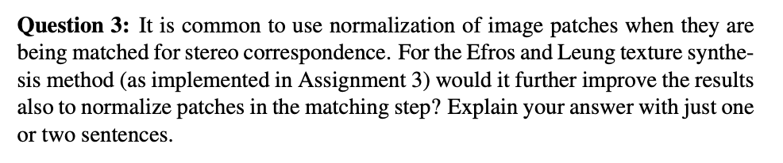
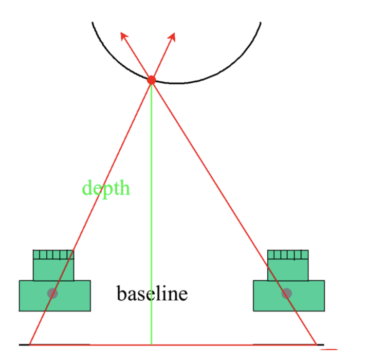
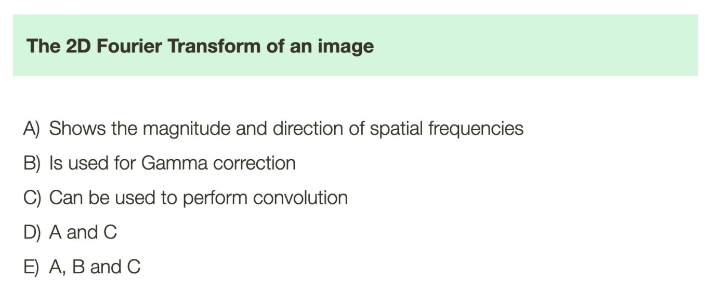
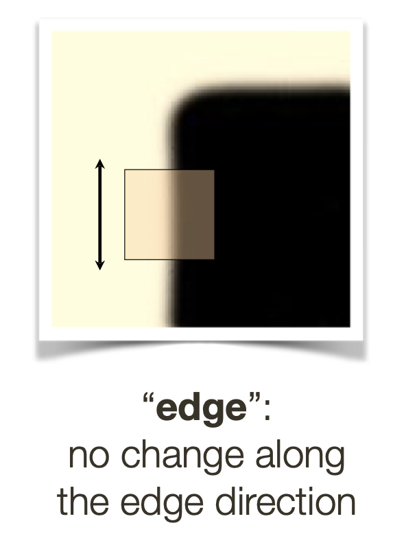
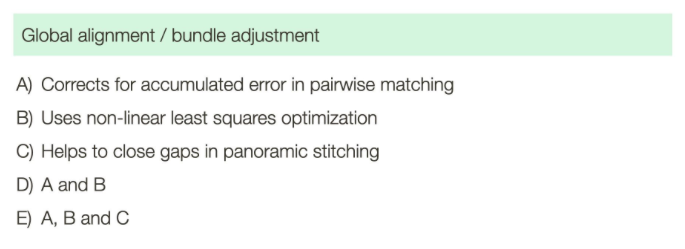
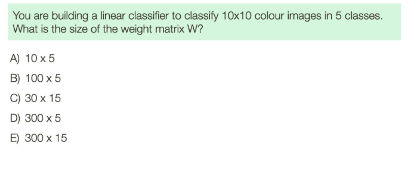

# Midterm Practice

## Quiz 1: Image Formation, Camera and Lenses

### Question 1

	

- A) this is True, that's what the pinhole camera is

- B) this is also True, perspective projections are inverted

  	

- C) this is False, you are able to move the focal length (how far the pinhole is from the wall)

- D) this is True, perspective projection means to create a two-dimensional representation of a three-dimensional scene which is what all cameras are doing

  - it trying to capture 3D world into a 2D surface (film or some photosensitive material)

### Question 2

	

- A) True - this was said in class
  - pinhole cameras are slow, because only a very small amount of light from a particular scene point hits the image plane per unit time
  - since a pinhole camera has a very small aperture, it lets in very little light so it requires a much longer exposure time to gather enough light to form a properly exposed image
- B) False - it uses perspective projection (i.e depths and stuff are preserved)
- C) False - whether it can capture colours or not is based on the sensor it uses
  - the pinhole itself lets light of all colours in

- D) False - we can use some formulas we used in class
  - we know **smaller aperture = bigger depth of field**
  - and since we have a tiny hole as our aperture - we have a huge depth of field (nearly infinite in fact)

### Question 3

	

- A) False
  - vignetting is about colour differences at the corners - has nothing to do with how straight lines look 

- B) False
  - this is chromatic aberrations

- C) True - the only thing we know about vignetting is the following
  - common photographic effect that occurs when the corners or edges of an image appear darker or less illuminated than the center
- D) False

### Question 4

	

-  A) True - this is the definition of Snell's law 
  - Snell's law, also known as the law of refraction, explains how light changes direction (bends) when it passes from one material into another with a different refractive index
- B) False - velocity is not involved
  -  ==corrections: The answer is TRUE==
  -  the bending angle is dependant on the refraction - the reason it bends is because it moves slower 
    - the light bends because it changes speed
    - so Snell's law is somewhat related to how fast light travels from one material to another
  -  the law relates to the indices of refraction of the two materials, which determine the speed of light in each medium
  
-  C) False
  - Snell's law does not describe the reflection of light off a mirror surface. It deals with the refraction of light as it passes through material boundaries, not with reflection
-  D) False - again, does not deal with reflection

## Quiz 2: Linear Filtering

### Question 1

		

- A) False - pillbox filter is NOT separable

- B) True - pillbox filter is rotationally invariant (because it's circular)

- C) True - it is does blurring - so it is a bit like a low-pass filter

  - ==answer is FALSE==
    - it is a low-pass filter (so first statement is correct), but second statement is false because we use Gaussian because it better
    - <u>pillbox kinda creates artifacts in the artifacts</u>

- D) True - see this example

  	

### Question 2

	

- A)  First, let's make the filter for the correlation
  $$
  \dfrac 1 2 \begin{bmatrix}
  0 & 1 & 0 \\
  0 & 0 & 0 \\ 
  0 & 0 & 0
  \end{bmatrix}
  $$
  

  - the 1/2 makes it so that we reduce the brightness by 50% 

  - the position of the 1 in the filter itself is a bit more complicated
    - let's imagine the filter was centered on point `(4, 4)` if the original image
      - note that the current coordinate system is `(row, column)`
    - the convolution would be `1 * image[3][4] + (0 * every_other_coordinate)` - so the result of the convolution would be the intensity that's present at pixel `(3 ,4)`, hence we've shifted the image down 1 pixel

- B) If we want it to be implemented as a convolution, we just have to flip it row wise and column wise
  $$
  \dfrac 1 2 \begin{bmatrix}
  0 & 0 & 0 \\
  0 & 0 & 0 \\ 
  0 & 1 & 0
  \end{bmatrix}
  $$

### Question 3

	

- A) when we are doing blurring because we want to preserves the mean of the filtered image

  - sum to 1 guarantees that the overall brightness level of the image is unchanged

- B) when we are doing derivative filters

  - <u>**sum to zero means that the output is zero when the input image is constant**</u> (which is what we want because we want to detect change)

- C) when we're doing template matching

  - because different regions might have different intensity, by not normalizing them we might get wildly different scores when matched with a template when it does't necessarily mean that one region is much more a like than the other to the template

    	

### Question 4

	

- A) let $m = 6\sigma$ (size of the 1D filters)
  - at each point, we are doing $m$ multiplication (convolve with first filter) and then another $m$ multiplication (convolve with second filter) &rightarrow; $2m$ operations at every pixel
  - we do this for ever pixel &rightarrow; there are $n \times n$ pixels
  - total is $(n \times n) \times 2m = n^2 \times 12 \sigma$
  - another way of looking at it: you're basically doing 2 separate convolution (on the intermediate results of course)
    - first convolution: $n^2 \times 6\sigma$
    - second convolution: $n^2 \times 6\sigma$
    - total: $12 \sigma \times n^2$
- B) again, let $m = 6 \sigma$ &rightarrow; but the filter is now $m^2$ in size
  - at each point we are doing 1 convolution - which is $m^2$ multiplications
  - do this for every pixel
  - so in total, $(n \times n) \times m^2 = n^2 \times 36\sigma^2$

### Question 5

Part 1

	

- basically, you need to do a matrix multiply between the 2 1D filter
  $$
  \begin{align*}
  A &= \begin{bmatrix}
  \frac 1 4 \\ \frac 1 2 \\ \frac 1 4
  \end{bmatrix} \cdot 
  \begin{bmatrix}
  \frac 1 4 & \frac 1 2 & \frac 1 4
  \end{bmatrix} \\
  \\
  &= \begin{bmatrix}
  (1/4)(1/4) & (1/4)(1/2) & (1/4)(1/4) \\
  (1/2)(1/4) & (1/2)(1/2) & (1/2)(1/4) \\
  (1/4)(1/4) & (1/4)(1/2) & (1/4)(1/4) 
  \end{bmatrix} \\ \\
  &= \begin{bmatrix}
  1/16 & 1/8 & 1/16 \\
  1/8 & 1/4 & 1/8 \\
  1/16 & 1/8 & 1/16
  \end{bmatrix}
  \end{align*}
  $$

  - note: the ordering 100% matters
    - $(3 \times 1) \cdot (1 \times 3) = (3 \times 3)$ but $(1 \times 3) \cdot (3 \times 1) = (1 \times 1)$ 

Part 2

	

- I guess above I was cheating a bit - what you're supposed to do was to perform a "full convolution" between them

  	

  - first one is "valid" convolution, there is no padding
  - third one is "same" padding, there is enough padding so that the result image is the same size as the original image
  - fourth one is full padding, blue square is padded as much as possible - so the result image (green) is even bigger
    - `row_padding = filter_row - 1` (do it twice, at the top and the bottom)
    - `col_padding = filter_col - 1`
    - in the last case, the filter is `(3x3)` so we pad the top row by 2 
  - note: we're also supposed to do a convolution - so the filter actually becomes `[1, 0, -1]`
  - we do full padding because we want to preserve the values at the end

- doing the padding (we flipped the filter here because it's a convolution)
  $$
  \begin{align*}
  A &= \begin{bmatrix}
  1/16 & 1/8 & 1/16 \\
  1/8 & 1/4 & 1/8 \\
  1/16 & 1/8 & 1/16 
  \end{bmatrix} 
  \circledast
  \begin{bmatrix} 
  1 &0 &-1
  \end{bmatrix}
  \\\\
  &= 
  \begin{bmatrix}
  0 &0 &1/16 & 1/8 & 1/16 &0 &0\\
  0 &0 &1/8 & 1/4 & 1/8 &0 &0\\
  0 &0 &1/16 & 1/8 & 1/16 &0 &0
  \end{bmatrix} 
  \circledast
  \begin{bmatrix} 
  1 &0 &-1
  \end{bmatrix}
  \\\\
  &= \begin{bmatrix}
  (0 \cdot 1 + 0 \cdot 0+ 1/16 \cdot -1) &(0 \cdot 1 + 1/16 \cdot 0 + 1/8 \cdot -1) &  (1/16 \cdot 1 + 1/8 \cdot 0 + 1/16 \cdot -1) & \dots  & \dots \\
  \ddots \\
  &\ddots \\
  & &\ddots
  \end{bmatrix} \\\\
  &= \begin{bmatrix}
  -\frac{1}{16} & -\frac{1}{8} & 0 & \frac{1}{8} & \frac{1}{16} \\
  -\frac{1}{8} & -\frac{1}{4} & 0 & \frac{1}{4} & \frac{1}{8} \\
  -\frac{1}{16} & -\frac{1}{8} & 0 & \frac{1}{8} & \frac{1}{16}
  \end{bmatrix}
  \end{align*}
  $$

  - note that this would be the filter for correlation, if you wanted it for convolution, just flip it

- ==TODID: how would you do this==

  - what I did is correct

- solution:

  		

  

## Quiz 3: Edges and Corners

### Question 1

	

- A) False
- B) True
- C) False 
- D) False
- Overall point: derivative filters are arranged in a way such that they sum to 0. This is because we want <u>**the filter to output 0 when the input image is constant**</u> (which is what we want because we want to detect change)

### Question 2

	

- A) False
  - we have 2 thresholds, but that is not what is asked for the question
  - we use the same $T_\text{high}$ and $T_\text{low}$ for both edge linking forward or backwards
  
- True 
  - ==the answer is FALSE==
    - it's because edge POINTS themselves don't need the thresholds - we just want to link them together better with the thresholds
    - doesn't affect accuracy - only help finding weak edges
  - (this has been said by the prof to be a shitty question as accuracy here is subjective)

- True - this is what the 2 thresholds are for 
- False - we need a threshold on the magnitude of the gradient (not on the partial derivatives themselves)

### Question 3

	

	

- A) False
  - scale invariant definition: if you scale the image, you would still find the corner at that point (scaling coordinate system as well)
  - you can think of it as because the algorithm depends on the size of the filter (i.e the window that we're sliding around) so scaling the object you might not find the corner anymore with that same filter size
  - the operations (computing gradient) requires smoothing, and the size of the smoothing matters
    - if you had image at different scale, you'd find a different gradient
- B) True - if you shift the corner around, the window will get slid over there eventually and we'll still be able to detect it
- C) True - the harris algorithm does not depend on orientation (i.e a 45 corner would also be detected, so you can rotate them and still find it)

### Question 4

	

- note: I read the question wrong - I thought it was why edges are broken sometimes
  - but in actually they just want <u>what will cause an edge</u>
- solution: 
  - a depth discontinuity (i.e., a foreground/background segmentation)
  - a surface orientation discontinuity (e.g., two intersecting planar surfaces)
  - a reflectance discontinuity (i.e., a change in surface colour/material on an otherwise smooth surface)
  - illumination boundaries (e.g., cast shadows, light sources, specularities)
- chatGPT
  - **Object Boundaries**
    - edges often occur at the boundaries of objects in a scene, where there is a change in the intensity or color between the object and its background
    - so the edge we're detecting is between an object and its background
  - **Texture Changes:** 
    - differences in textures, patterns, or surface properties within a scene can result in edges
    - when one area of an image has a different texture or pattern than its neighbouring regions, an edge can be observed where the transition occurs
  - **Depth Discontinuities:**
    - in 3D scenes, changes in depth or disparities between objects can cause edges
    - these depth changes are often reflected as brightness or intensity discontinuities in two-dimensional images
  - **Material Changes:** 
    - when different materials or substances with varying reflective properties are present in a scene, they can lead to brightness or colour changes and, consequently, edges in the image
  - **Shadows:** 
    - shadows cast by objects can result in intensity changes, leading to the presence of edges in the image
  - **Illumination Changes:** 
    - variations in lighting conditions, such as gradients in illumination, can create brightness discontinuities or edges

### Question 5

	

- it's easiest to start with B

- B)
  $$
  \begin{align*}
  \text{det}(A - \lambda I) &= \lambda^2 (I_x^2 \cdot I_y^2) - (I_xI_y)^2 = 0 \\
  (I_x^2 -\lambda)(I_y^2 - \lambda) - (I_{x}I_y)^2 &= 0 \\
  \lambda^2 - I_x^2 \lambda - I_y^2 \lambda &=0  \\
  \lambda (\lambda - I_x^2 -I_y^2) &= 0\\
  \lambda &= 0, ~I_x^2 + I_y^2
  \end{align*}
  $$

  - since there is only 1 non-zero eigenvalue, this tells us that the rank is 1
  - another way: can get rank from determinant ($\text{det}(A) = 0$ implies there's a rank of 1 or less)

- A) the rank is 1 (see above)
  
- C)

  - squaring operator itself is a non linear
  - but since the same operation is applied at every pixel - so position does not matter, in that case it is shift invariant 

## Quiz 4: Textures

### Question 1 

 

- A) True 
- B) False - texture synthesis is more tractable (easier) than texture analysis
- C) True
- D) True 
  - this makes sense because Laplacian allows us to represent image at scale
  - oriented filter banks allow us to represent image in different orientations
  - by applying a set of oriented filters to each layer of the pyramid, one can capture the orientation information at multiple scales, creating an "oriented pyramid"

### Question 2

	

- A) False - very similar to below above but the important part is <u>repeating</u>
  - extra randomization means that the pattern is less likely to be **repeating**
  - this is not to say that the result won't be worse - hence why the one below is true 
- B) True - as the degree of randomization increases, the accuracy of the selected patches from the sample texture may indeed decreases
  - so the resulting texture will be <u>unrealistic</u> overall
  - the algorithm is more likely to select patches that are not the closest match to the surrounding texture, <u>potentially</u> leading to less accurate and less realistic textures
- C) TODID: how would a larger training sample help if we're still picking randomly?
  - don't worry too much for this one
- D) TODID: why is this false - is this why there's randomization in the first place?
  - point of randomization is not for speed, but for variety
  - the algorithm still needs to compute the similarity between patches to determine which ones are "good" matches before randomization is applied

### Question 3

	

- No, this will not work
  - in template matching - we want to match so that the SHAPE matches and not the INTENSITY (i.e a bright face should still match with a dark face - because they are both face shaped)
  - but in texture synthesis, brightness matters as well
  - so if we normalize the patches ("filters") - we will sometimes match dark patches with light patches, causing a unrealistic results

- - 

## Past Midterms 

- question 7 

   

  - from the projection equation, we can say that 
    $$
    \begin{align*}
    su &= X \\
    sv &= Y\\
    s &= Z  \\
    \\
    \therefore u &= X/Z,~~ v = Y/Z
    \end{align*}
    $$

  - compute all the points $(u, v)$ like so (divide by the $z$ value)

  - we get $(1, 1), (1/a, 1/a), (-1, 1), (-1/a, 1/a)$

  - if we draw this out for $a = 2$, we can see that they are shrinking towards a point, if we make $a$ bigger, it's approaching a vanishing point

     

- question 9

   

  - part a

     

    - so no padding, we can just do it and we can see 

       

  - part b

     

    - just by doing the correlation, we can see that a pattern is that we're taking a point in front (to the right of the center), and subtracting it by a point backwards &rightarrow; a bit like taking differences/derivative

    - we can also see that this is a Sobel filter - which we know can be broken up

    - again, see that it's forward minus backwards - so we know it's a horizontal derivative - so the horizontal component of the filter will be $[-1, 0, 1]$, and the other part is just the blurring

       

    - this can be used for edge detection (for Sobel's algorithm you'd need both the horizontal and vertical gradient and their magnitude though)

- question 11

   
  $$
  \begin{align*}
  H - I \lambda &= \begin{bmatrix}
  1 - \lambda & 2 \\
  2 & 4-\lambda
  \end{bmatrix}
  \\
  det(H - I\lambda) &=  2(2) - (1-\lambda)(4-\lambda) \\
  &= 4 - 4 -5\lambda - \lambda^2 = 0 \\
  \lambda^2 - 5 \lambda &= 0\\
  \lambda &= 0, 5
  \end{align*}
  $$

  - since one of the eigenvalue is small, while the other is big &rightarrow; it's likely to be an edge

  

# Final Practice

## Quiz 5: Fitting Data to a Model

- (couldn't do the first 2 question because they were about Hough Transforms for some shit like that )

- question 3

   

   

  1. It means we are not assuming any underlying distribution about the sample
     - <u>**solution**</u>: close but not quite &rightarrow;  "Non-parametric means that no assumptions are made about the particular functional form a model (or representation) takes"
  2. Yes, since we are doing an exhaustive search over the sample patch every time to find the closest match to our generated texture
     - solution: correct &rightarrow; "Efros and Leung sample texture directly from windows in the image. They make no assumptions about the functional form an analytic or synthetic model of the texture might take"

- question 4

   

  - first, not that you require 3 points to fit a circle (basically extrapolate the circle from a triangle)

  - then you can define
    $$
    \begin{align*}
    P(\text{success for 1 trial}) &= (1/4) ^3 = \dfrac 1 {64} \\
    P(\text{failure for 1 trial}) &= 1- \dfrac{1}{64} = \dfrac{63}{64}  \\
    \\
    P(\text{no success in $k$ cycles}) &= \left(\dfrac{63}{64}\right) ^k \\
    \left(\dfrac{63}{64}\right) ^k &< 0.05 \\
    k \cdot \ln \left(\frac{63}{64}\right) &< \ln(0.05) \\
    k &\geq \dfrac{\ln (0.05)}{\ln \left(\frac{63}{64}\right)} \\
    & \geq 190.225
    
    
    \end{align*}
    $$

  - thus, 191 samples are required

    - solution: this is correct

## Quiz 6: Stereo, Motion and Optical Flow

- question 1

   

  1. True. For the stereo and epipolar line thing to hold, two cameras must be on the same plane

     - <u>**solution**</u>: False. While usually, 2 cameras being on the same plane is preferred, it is not required. If they are on the same plane, then the epipolar line is horizontal so it simplifies the math a bit

  2. True. Because if not then you'd have multi view problem instead

     - <u>**solution**</u>: False. Stereo is usually used to capture the same scene from different views. Even in our stereo camera, the 2 cameras are angled towards a point - much like human vision

        

     - TODO: double check this &rightarrow; also what is parallel optical axes

  3. False. You can rectify the images so that they are on the same plane so that the math simples out, but this is not required, the epipolar constraints will hold regardless.

  4. False. We know there's the planar constraint

     - <u>**solution**</u>: True. We know that they don't have to be on the same plane so the cameras can be oriented however they want as long as they are pointing at the same scene

  - note: the big problem with this question was that I operated under the assumptions that the cameras must be on the same plane for stereo vision &rightarrow; THIS IS NOT THE CASE

- question 2

   

  1. False. We know that bigger windows mean less noise
     - it's less impacted by noise because it's averaging over more pixels
  2. True. Larger windows means that there are less details
     - since we're averaging, this affects the precision of feature localization
  3. False. Not sure why
     - <u>**solution**</u>: it's because we'll include pixels from different depths in the same window, which will cause the correlation measure to fail, so harder to find matches across the window
  4. True. There will be more matches
     - <u>**solution**</u>: False. This is not asking about the number of matches, but asking about the effectiveness of the epipolar constraint. The epipolar constraint holds regardless of window size

- question 3

   

  1. True. This is the brightness constraint &rightarrow; made in every algorithm we learned, not just LK
  2. True. We say that all the delta are small to make the derivatives more accurate 
  3. False. Do not think this was a requirement
     - <u>**solution**</u>: True. This is literally the assumption that LK method makes to make the equations works. The method assumes that the motion of the pixels within the window is approximately uniform
  4. True. The matrix have to have this property for the series of equations to be solvable (hence why this algorithm works best when there are interesting features in the patch)

- question 4

   

  - assuming the set up of the experiment was one where 2 cameras are on the same plane
  - having 2 pictures side-by-side helps illustrate the fact that their epipolar lines are parallel to each other
  - also this is more representative of human vision, since human eyes are side-by-side
  - (this stereoscopic experiment was likely about fusing the 2 pictures together organically using your eyes - like a 3D type thing)
  - in cases where the left image is placed on the right and the right image on the left, the brain can still fuse these images into a single 3D image, but the depth perception will be reversed (what should appear near will appear far and vice versa) because the disparity between corresponding points is inverted

- question 5

   

  1. If you are looking at a blank wall at different perspectives. There might not be enough unique features about the scene to match 
  2. When there are closely spaced, visually similar features - like a brick wall.
  3. When you have repeating textures, like a wall of flowers. Even from different perspectives it's hard to say which flower match to which flower

- question 6

  - simply can't do this problem because we didn't learn Hough

## Quiz 7: Segmentation and Classification

- this quiz looks a little strange, I think a lot of stuff we didn't cover in this version of the class 

- question 1

   

  (this is what an ROC curve looks like)

   

  1. True. This diagonal represents a random classifier - meaning it's randomly assigning classes
  2. True. TPR of 1.0 with FPR of 0 is perfect
  3. True. You can use it to balance between TPR on FPR of your model
  4. True. Same reasoning as above

- question 2

  - we didn't learn this kind of clustering

- question 3

   

  - you can try to minimize the inter-cluster distance
  - that is look at the distances between the points in the clusters to their cluster center &rightarrow; we sum them all up
  - the model with the lowest sum is the best one

- question 4

   

  1. You can do the math but it's also pretty obvious. `(1,2,4)` will be cluster A and `(3,5,6)` will be the other cluster B. The new cluster mean is 
     $$
     \begin{align*}
     A &= \{(1,3), (2,1), (3,2) \} \\
     \text{new cluster center of A} &= \left(\dfrac{1+ 2+ 3}{3}, \dfrac{3 + 1+ 2}{3} \right)\\
     &= (2, 2)\\
     \\
     B &= \{ (2,6), (3,5), (4,7) \} \\
     \text{new cluster center of B} &= \left(\dfrac{2+3+4}{3}, \dfrac{6+5+7}{3} \right)\\
     &= (3, 6)
     \end{align*}
     $$

  2. No, if you re-ran the algorithm, you would still assign the same points to the same cluster center

- question 5

  - A) basically draw the same curve but with the center (peak) slightly shifted to $x=1$ for distribution B

      

  - B) with the given curve

    - you basically want $P(A \mid x) > P(B \mid x)$ or vice versa - we're talking about the y-values here

    - so you can see that where the curve intersect (call it 0.5), everywhere to the right of that, y value of B is bigger than y-value of A, and vice versa for the left of 0.5

    - so we can see that the boundary is at 0.5

  - C) this is basically saying that the cost of predicting B when it's actually A is 10, and the cost of predicting A when it's B is 1

     

    - I'm assuming the model will be a lot more inclined to predict A
    - so the decision boundary should shift right so that we will predict A more often &rightarrow; that is $x > 0.5$

  - D) this would be a False Negative, we predicted negative (B) when it is actually positive (A)

## Quiz 8: Colour

- question 1

   

  - A) False. Pretty sure modern displays RGB 
    - but technically you could, instead of using RGB lights/dots, you could you XYZ primaries instead, but there are compatibility issues so we don't
  - B) True. I know this is true for `[L M S]` responses, but not sure how those exactly map to RGB
    - yea so this is true, this is the very core principle of metamerism - where two different spectral power distributions can produce the same colour sensation and thus look identical to the human eye, even though the physical light spectra are different
  - C) Literally no idea
    - <u>**solution**</u>: False. Fluorescent bulbs are more efficient than incandescent bulbs **but** the statement is incorrect in attributing this efficiency to the tuning of the bulb’s output to the spectral response of human scotopic vision (means vision under low-light levels). Both lights are designed for photopic (daylight vision)
  - D) True. We have more rods then we do cones and rods are used for night time

- question 2

   

  - A) True. Just like how for RGB the colours at the corners of the triangle are primaries, same with CIE - the things at the corners are their primaries
    - <u>**solution**</u>: False. The three lights should ideally cover a wide range of the colour space and be able to mix to match as many perceivable colours as possible. The corners of CIE are just the most saturated colours humans can perceive - doesn't have anything to do with this
    - another way to think of it is the fact that we do RGB mixing where RGB are the primaries - but RGB does not lie on the corner of CIE colour diagram
  - B) False. CIE primaries are a combination of colours - not like RGB where individually they are R G B which stimulates a single colour receptor
    - also all three types of cones (which are sensitive to different ranges of wavelengths) have overlapping ranges of sensitivity, and a single light source will typically stimulate more than one type of cone
    - key is that the three lights must be chosen such that their combined stimulations can produce the range of colours that can be perceived by these overlapping cone responses
  - C) False. Just like RGB, you can just have Red or just X in the CIE case 
  - D) False. you probably can
    - <u>**solution**</u>: True. It is indeed impossible to find three light sources that can exactly match all the colours perceivable by the human eye
    - TODO: I thought CIE XYZ can cover all perceivable lights 
      - you can't shine lights that are the XYZ primaries to create colors in the same way you can with RGB lights
      - The X, Y, and Z primaries are not physical colors; they are mathematical components in the CIE XYZ color space so you can't shine and then mix and match them

- question 3

    

  (not sure if we actually learned this in class - I think we did it for gamma correcting or something like that, the thing about snow actually being blue but appearing white to humans)

  - Color constancy is the ability of the human visual system to perceive the colors of objects as relatively stable and consistent under varying lighting conditions
  - The purpose of color constancy algorithms is to replicate this perceptual phenomenon in computer vision and image processing
  - These algorithms aim to ensure that the colours of objects appear consistent, or close to their true colours, regardless of changes in illumination
  - given all of this, only D is the correct answer

- question 4

   

  - TODO: better explanation
  - ChatGPT: In simpler terms, a uniform colour space is better for matching paint colours because it's designed to match the way we see colours. This means that if two colors look slightly different to us, they will also look slightly different in the uniform color space. The CIE XYZ colour space doesn't match our vision this way, so it's not as good for making sure paint colours look the same to our eyes.

## Quiz 9: Neural Networks

- question 1

  - A) False. I think it would have less information since we are just taking the max over a neighbourhood
    - <u>**solution**</u>: True. By taking the max, it makes the neurons in subsequent layers have a 'larger' receptive field, meaning they are affected by a larger part of the input image
  - B) False. Doing max pooling reduces the output dimension. If your neural network was a FC NN - this would actually greatly reduce the number of parameters for later layers
  - C) False. Since we are doing max-pooling, the network is less sensitive to positions
    - so we're making it less sensitive to translations in the input image &rightarrow; because it takes the maximum value within a window, small changes in the position of the feature within that window will not change the output of the max-pooling operation

- question 2

  - A) Not sure
    - <u>**solution**</u>: False.
      - scale invariance means that if you enlarge or reduce the size of an input image, the network would still recognize the objects in the image with the same accuracy
      - basic CNN without additional scaling mechanisms does not inherently possess this property; its filters are designed to detect patterns at a scale they were trained on
    - ==TODO: how to determine if something is scale/rotation/etc invariant or not==
  - B) False. Rotating the input image gives different results
    - if you rotate the input image, the patterns that the convolutional filters have learned to detect may not be recognized if they appear at a new, untrained orientation
    - recall from template matching, convolutions can't detect features when they are rotated
  - C) True. Shifting the image slightly will give same result 
    - TODO: why, chatGPT say it's because of max-pooling (also don't say "Convolutions are shift-invariarnt" - WHY are they shift invariant)
  - D) False

- question 3

  - forward pass: to compute the linear combination and activiation function
  - backward pass: to compute the partial derivatives for all the parameters with respect to the loss 

- question 4

  - $\lambda$ in this case is the step size or learning rate
  - setting this to be too large means that you converge too quickly, but it's possible to overshoot the optimal solution and never getting a solution (or getting a bad one)
  - setting this to be too small mean that you converge very slowly, more likely to get a good solution but there's a possibility that you end up in a sub-optimal minima

- question 5

  - note: the question is asking <u>"You want to map **every possible image** of size 64 x 64 to a binary category (cat or non-cat)"</u> and not "how many bits are needed to map **one** image"
  - with `64x64` image and `3` channel you have `64x64x3` total cells that you need to fill
    - the first cell can take 256 values
    - 2nd cell can take 256 values
    - 3rd cell can take 256 values, etc
    - so overall the combinations are $256^{64\times64\times3}$
  - TODO: better explanation

- question 6

  - A) assuming we're talking FC NN here
    - TODO: see 19.4 in the notes - the dimensions are backwards, how are they going to handle that
    - hidden layer
      - 100 hidden layers means that we have 100 rows in $W_1$
      - all the neurons in hidden layer is fully connected with the input which is all the pixels in the image or $64 \times 64 \times 3$
      - so $W_1$ is $100 \times 12288$
    - output layer 
      - you will only need <u>**1 neuron in the output layer**</u> (because it's binary) &rightarrow; so $W_1$ have 1 row
        - TODO: is this a special feature because we have binary, say we have 4 mutually exclusive classes, how many neurons do we need? ChatGPT says yes
      - there are 100 neurons in the hidden layer which is fully connected to the output layer, so we have 100 columns
      - so $W_2$ is $1 \times 100$
  - B) do we have 1 bias per neuron? if so then 
    - $b_1 = 100 \times 1$
    - $b_2 = 1 \times 1$
  - C) it should be the sum of all the elements in $W_1, W_2, b_1, b_2$
    - so it's $(64 \times 64 \times 3 \times 100) + (1 \times 100) + (100) + (1)$
  - D) you have the number of parameters from C), each of which takes 64 bits to represent, so you just multiply the value above by 64
    - $64 \times [(64 \times 64 \times 3 \times 100) + (1 \times 100) + (100) + (1)]$

- question 7

  - A) reasonable idea

    - filter size of $11 \times 11$ since that's the biggest a car can be
      - note that we don't need to make a 3D filter because the picture is in grayscale
    - activation layer (max-pool) has no parameters
      - but the size of the output map is $(1024 - 10) \times (1024 - 10)$ because we don't pad
      - (it cannot slide over the last 10 pixels of the image's border, which explains the subtraction of 10)
    - we'd have $(11 \times 11) + 1$ weights to learn so 122
      - the extra 1 is the bias term

  - B) I'm guessing

    - you add more filters in hopes that they will pick up different parts of a car 

    - another thing you can do is blur and downsample the image 

    - or just add more layers

    - <u>**solution**</u>: something to do with receptive field

       

      - A single layer with a 3x3 filter has a receptive field of 3x3. When you stack another 3x3 filter layer on top, the second layer's neurons are not just looking at a 3x3 area from the original image; they're looking at a 3x3 area from the first layer's feature map - which looks at the 3x3 feature map from the original image &rightarrow; the overlap shown here say that it's seeing 5x5 neighbourhood in the original image
      - so first layer you see 3x3
      - second layer you see 5x5
      - third layer you see 7x7 
      - fourth layer you see 9x9
      - fifth layer you see 11x11
      - so you want to do 5 consecutive layers of 3x3 filters &rightarrow; this is $5(3 \times 3) + 5(1) = 50$ parameters including biases

  - question 8

    - since all of the filters are in 1 convolution layer, the stride doesn't really affect the number of parameters, we have 48 weight matrices, each of which are $(7\times 7 \times 128) + 1$ so in total it's $48 \times (7 \times 7 \times 128 + 1)$
    - the output size after applying will be affected by the stride
      - if stride was 1, we'd have $(512 -6) \times (512 - 6) \times 48$
      - so if the stride is 2, make sense we'd have $\dfrac{512-6}{2} \times \dfrac{512-6}{2} \times 48$

  - question 9

    - I would apply max-pooling, max-pooling reduces the dimensions and is a way of down smapling
    - do multiple convolutional layers so that it can learn multiple abstract features (i.e nose, eyes, mouths, etc)
    - in my assignment, I created my own filter (i.e using a picture of a face), in the NN case, the weights/filters will be learned during the training process
    - ==TODO: why is the answer so different==

  - question 10

    - A) so there are 8 filters, each are $5 \times 5 \times 6$ - so they're $(8 \times (5 \times 5 \times 6) +8)$ parameters
      - extra 8 for the outputs
    - B) multiply it all together $(6 \times 20 \times 20) \times (8 \times 10 \times 10)$
      - we'll have $6 \times 20 \times 20$ input nodes
      - we need $8 \times 10 \times 10$ neurons in the hidden layer to make it match the dimensions specified in the question

  

# In-class Quizzes

## Quiz 1

- question 1

  	

  - A) False - because cameras uses perspective projection, parallel lines will be altered to show depth 
  - B) False - rays are projected through the pinhole onto the image plane 
  - C) True - because it simulates depth (i.e human perception) - far away objects appear smaller
  - D) False - points are projected based on their individual depths (distance from the image plane), not their average depth (this would be scaled ortho &rightarrow; simulates depth perception)

- question 2

  	

  - A) True - orthographic perception ignores depth, so parallel lines appear parallel

  - B) True - it's a bit confusing but since it ignores depth, the rays that are projected only comes from the "face" that's parallel to the image plane, thus the rays from that is perpendicular to the image plane

     

  - C) False - there's no depth so things don't appear "smaller"

  - D) False - again, no relation to depth

  - E) True since both A and B is true

- question 3

  	

  - for diffuse surface, light is reflected everywhere &rightarrow; key point is that the observed intensity is independent of the viewer's position, but depends on the angel between the light source and the surface
  - hence only B is true

- question 4

  	

  - so the only interesting value is to the right - so it is actually <u>shifting left</u>
    - (run it on a 5x5 image with only 1 in the middle)
  - the value is also 2 so that means it's doubling the value at a point - so it's actually brightening the image
  - so the answer is A

- question 5

  	

  - note: this question is about convolution instead

  - you can flip the kernel twice, it'll look like
    $$
    \begin{bmatrix}
    0 &0 &0 \\
    2 &0 &0\\
    0 &0 &0
    \end{bmatrix}
    $$

  - it still brightens but it's shifting it right now

  - so B is right

- question 6

  	

  - A) True, it's blurring is it's low-pass
  - B) True, it's circular so it's rotationally invariant (if you want to think about it like that)
  - C) No, the function for the pillbox is super messy - not separable
  - thus D is true

## Quiz 2

- question 1

   

  - A) False - that's the median filter
  - B) True - it assigns Gaussian weight based on how far a point is from the center point (domain) and how far apart their values are (range)
  - C) False - this just isn't true
  - D) True - this is a hallmark of Bilinear - it smooths while preserving edges
  - so E is correct

- question 2

   	

  - A) True - you sample more and you won't lose as much information
  - B) True - blurring the input "smooths" the info - so when you sample, you're not losing as much 
  - C) True - same thing as blurring above
  - so E is true

- question 3

  	

  - point: you have to sample at a rate $f_s$ that's 2 as much as the maximum frequency $f_\text{max}$ of a signal
  - so C is True

- question 4

  		

  - (I would personally not worry too much about this question)
  - A) True - FTT transforms from spatial domain into frequency domain
    - B) False - Gamma correction uses the power rule to make things brighter
  - C) True - the 2D Fourier transform can be used to perform convolution in the frequency domain
  - so D is True

- question 5

  	

  - A) False - we use Gaussian, using a Laplacian might highlight the edge and stuff more, which in this case (looking for faces) isn't what we want
  - B) False - same reason as above, we're not looking for edges here
  - C) False - it'll still be sensitive to scale (now can't detect small faces)
  - D) True, for a couple of reasons
    - it's less sensitive to brightness 
    - produces an interpretable score that's between -1 and 1
  - E) False - just makes things more efficient, not robust
  - so D is true

- question 6

   	

  - Gaussian FILTER is a low pass filter
  - Laplacian FILTER is a high pass filter
  - when you combine the Gaussian smoothing with the Laplacian operator, you obtain a filter that passes a certain band of spatial frequencies while attenuating both low and high frequencies

## Quiz 3

- question 1

  	

  - A) True - this is why we blur
  - B) False - this is not anything to do with blurring, it's a technique you have to do
  - C) False - blurring doesn't help this 
    - think of the window experiment, blurring does not fix this at all
  - so A is correct

- question 2

   

  - aperture problem: when things are hard to localize - if you slide a window up and down an vertical edge, it's hard to tell where exactly in the edge you are - because it all looks the same

    	

  - corners can be localized very reliably - so aperture problem is NOT an issue

  - so it's matching edges that's the problem

  - so the answer is C

- question 3

  	

  - A) True - 2D structure means they can be localized in both direction (again, window thought experiment)
  - B) True - same as above
  - C) True - corners are when 2 edges meet (so not parallel) - thus they must have a mix of gradients 
  - so the answer is E

- question 4

  	

  - they ones involving current and immediately adjacent pixels (i.e $x \text{ and } ~x+1$) will suffer from shift
  - so the answer is E 
    - C is also centered but it's in both directions - we just want the $x$ direction

- question 5

  	

  - A) True - texture filter banks often include Laplacian of Gaussian (LoG) filters because LoG filters are effective at capturing and enhancing the details and fine structures present in textures
  - B) False - this blurs, doesn't do anything interesting
  - C) True - this is the core, combinations of edges is usually how we detect textures
  - so the answer is D

- question 6

  	

  - A) False - that's analysis, we're not creating anything here
  - B) True - we are creating more of a texture
  - C) False - I believe the key here is that Nyquist sampled signal are do not require interpolating (they can be reconstructed perfectly without loss)
    - ChatGPT also agrees that this is False but argues that it's because "This refers to signal processing, where interpolation is used to estimate new data points within the range of a discrete set of known data points. Texture synthesis does not directly relate to signal interpolation; it's more about spatial pattern extension in images"
    - not sure if I 100% agree with this as in class it was said that images can be seen as signals that can be sampled - but to satisfy Nyquist you need to sample once per pixel (hence you just have the entire picture)

## Quiz 4

- question 1

   

  - (I'm using a lot of examples from the face-template matching portion of the course)
  - A) False - recall to template matching, if your template is a different orientation than your picture, it won't match, thus it is not invariant to rotation
  - B) True - if you're simply shifting the face in the picture, your template would still pick it up
  - C) False - if the face is too big or too small compared to the template, it won't be detected &rightarrow; this is why we do it with a pyramid
  - D) False - again, it's not invariant to rotation

- question 2

   

  - (this is basically asking what do we need to know about the keypoint location to calculate the descriptor)
  - A) True - this is why SIFT is widely used
    - only weird one was 3D pose, apparently by using the gradient and and descriptors - you're able to be insensitive to small 3D pose change
  - B) True - SIFT algorithm provides the (X, Y) coordinates where each keypoint is detected in the image
  - C) True - SIFT detects keypoints across multiple scales, and each keypoint is associated with the scale ($\sigma$) at which it was detected (Gaussian blur level)
  - D) True - at each keypoint, SIFT computes the gradient magnitudes and orientations in its neighborhood and assigns a dominant orientation based on these gradients
    - allows for rotational invariance 
  - E) False - nothing about SIFT says anything about axes of affine deformation 
  - So the answer is E

- question 3

   

  - (we can see that we have `[0,0,1]` on the last row - this means that it's an affine transformation, and we know that affine transformations preserve parallel lines)
  - answer is E)

- question 4

   

  - you actually can do the math here, but it's not necessary
  - the point is that you need to know how many points you need to fit a circle &rightarrow; it's 3, you basically extrapolate from a triangle; so $n = 3$
  - now we know our outlier percentage is 40%, we can look up $n= 3, \text{prop of outlier} = 40\%$ in the table and that gives us 19 samples
  - so answer is B

- question 5

   

  - A) False - we use stereo cameras (not sure what LIDAR is - we didn't learn it)
  - B) True - since points appear along a epipolar line in corresponding image, it's a 1D linear search
  - C) False - opposite of the above
  - D) False - disparity tells us information about the depth of the image, we're not trying to minimize it 

- question 6

   

  - this was something kinda mentioned in class, but far away objects have small disparity while objects close to the cameras have larger disparity
  - so answer is C)
  - (experiment: hold a pencil close to your face and shut one of your eyes, do the same for the other one; repeat this for different distances)

## Quiz 5

- question 1 

   

  - A) True - we need the brightness constancy assumption to even get this equation
  - B) False - optical flow (tracking brightness) itself succumb to the aperture problem
  - C) True - we have 1 equation and 2 unknown, this is under-constrained
  - answer is E

- question 2

   

  - LK algorithm simply assumes that pixels within the same neighbourhood are moving in the same direction (i.e have similar optical flow vectors)
  - so the answer is just A
  - in fact, for B) - the LK algorithm would actually perform very poorly because it prefers patches with interesting textures and features

- question 3

   

  - A) True - RANSAC is used for outlier removal
  - B) False - RANSAC itself doesn't solve for camera and structure parameter - we need SVD or LSE
  - C) True - in multi-view matching we can do RANSAC between pairs of images to establish which one is the best match??
  - answer is D

- question 4

   

  - A) True - this is the reason for global alignment 
  - B) True - you need some complex algorithm to solve
    - Levenberg-Marquardt is the most popular NLLS algorithm (not that he mentioned this in class)
  - C) True - it does help close gaps and make panoramic pictures look better
  - answer is E

- question 5

   

  - we've seen in class the BOW is used to identify something like "Car" or "Dog" but not "Porsche" and "Golden Retriever" - this is object category 
    - this is why we needed to pick out features and assign histograms, so that objects with similar feature frequency have similar histograms
  - so the answer is B) only

- question 6

   

  - code book here means our dictionary &rightarrow; so we have 1000 words in our dictionary 
  - this means that no matter what the new image is, it'll get assigned to a histogram with 1000 words (bins) that aligns with our dictionary, so the answer is B
    - basically the image gets turned into a vector with 1000 columns, each column corresponding to one of our SIFT visual word

## Quiz 6

- question 1

   

  - from class, it's kinda jagged &rightarrow; it's piecewise linear

- question 2

   

  - A) False - it is non-linear, that's the entire point
  - B) False (through process of elimination)
    - we know C is for sure True and A is for sure False
    - this can't be True because there's no option for B and C
    - invertible also means that "unique input maps to a unique output" (one-to-one) but you can see that $f(-1) = f(-2) = f(-\inf) = 0$ so it's not one-to-one (multiple output can map to 0)
  - C) True - this is the formula
  - answer is C

- question 3

   

  - (in my mind the number of rows is the number of classes we have, but here it's opposite but it's fine)
  - we have 5 rows because we have 5 classes
  - in linear classification, we also mention throwing away spatial information and just vectorizing all the pixels as 1 big vector, so now we have $10 \times 10 \times 3 = 300$ columns
  - answer should be D (flip row and column)

- question 4

   

  - A) False - didn't learn it, also not used for NN
  - B) False - since ReLu is non-linear, we can't solve this using LSE
  - C) True - SGD perform gradient descent on a batch of data for speed
  - D) False - it doesn't use the image gradients, it rather uses the gradient of the Loss function of the NN

- question 5

   

  - A) True - this is the backbone of backprop
  - B) False - not sure what this is and we didn't learn it
  - C) False - it uses backward mode auto-diff
  - answer is A

  